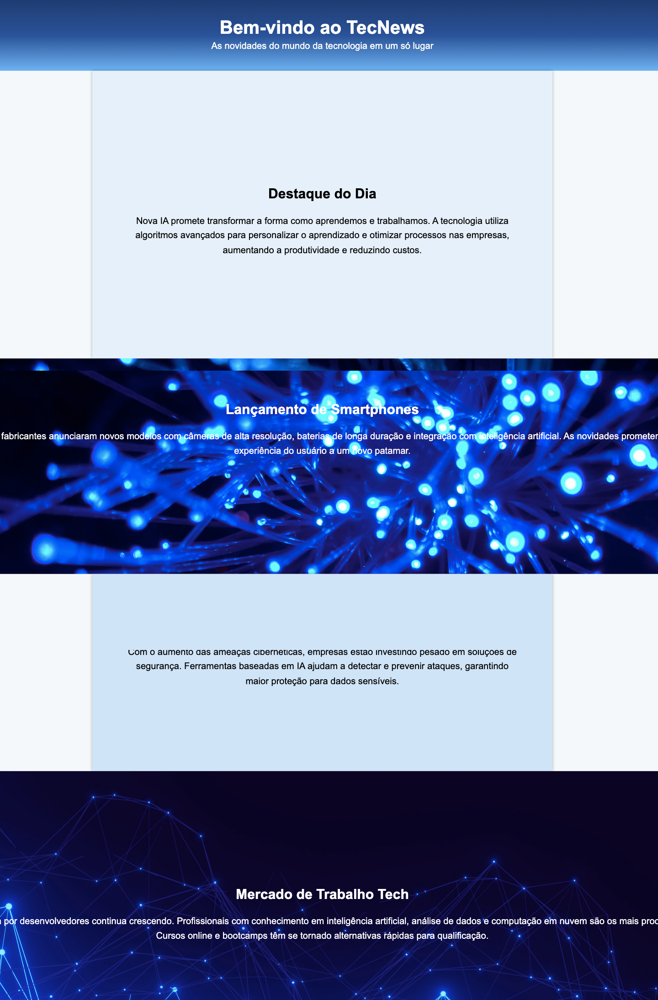
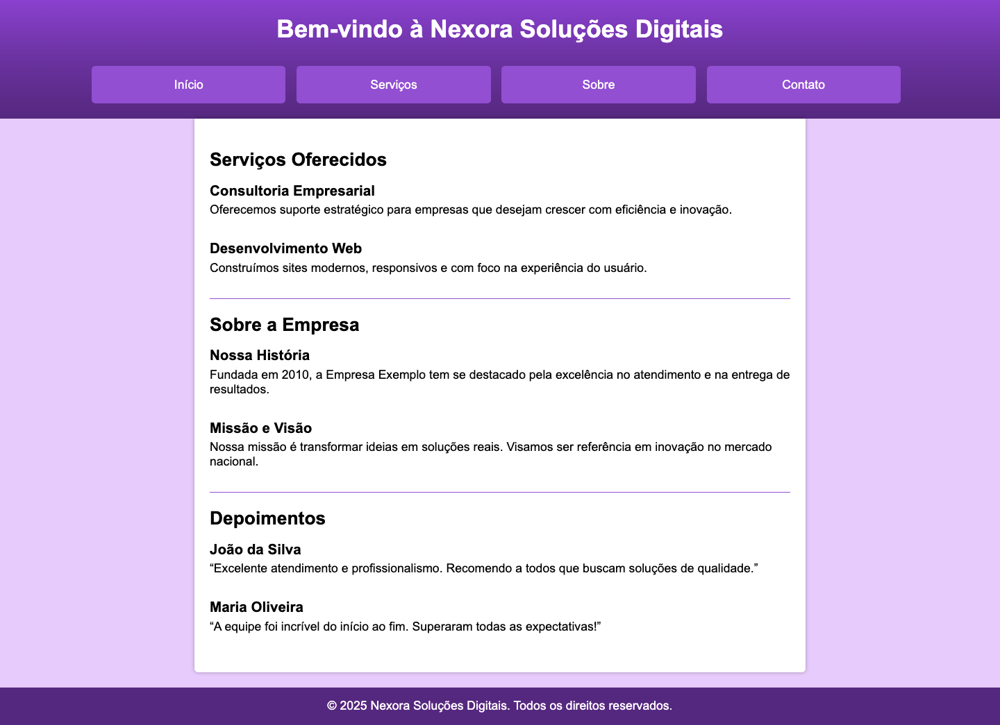
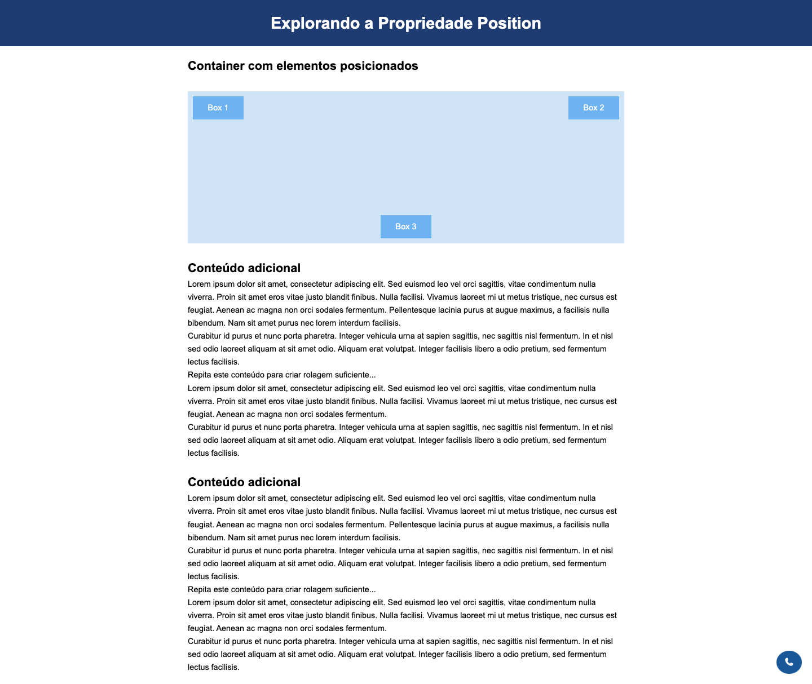
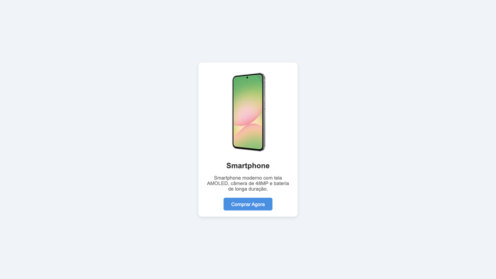

## 📝 Exercícios 

---

### 🔹 Exercício 1 – Personalizando o Fundo
**Descrição:** Você irá praticar a personalização do fundo de algumas seções de um site usando as propriedades relacionadas a **background**: `background-color`, `background-image`, `background-position`, `background-repeat`, `background-size`, `background-attachment` e a `shorthand`. E aplicará também um gradiente.

**Código Base (HTML):**
```html
<!DOCTYPE html>
<html lang="pt-BR">
<head>
  <meta charset="UTF-8">
  <title>TecNews</title>
  <link rel="stylesheet" href="style.css">
</head>
<body>
  <header>
    <h1>Bem-vindo ao TecNews</h1>
    <p>As novidades do mundo da tecnologia em um só lugar</p>
  </header>

  <section class="destaque">
    <h2>Destaque do Dia</h2>
    <p>Nova IA promete transformar a forma como aprendemos e trabalhamos.</p>
  </section>
</body>
</html>
```

<br>

**Código Base (CSS):**
```css
* {
  margin: 0;
  padding: 0;
  box-sizing: border-box;
}

body {
  font-family: Arial, sans-serif;
}

header {
  text-align: center;
  padding: 30px;
  color: white;
}
/* primeira seção */
main section:nth-child(1) {

}
/* segunda seção */
main section:nth-child(3) {

}

section {
  height: 500px;
  text-align: center;
  padding: 200px 60px 0;
}

h2 {
  margin-bottom: 20px;
}

p {
  line-height: 1.6;
}

.center-section {
  max-width: 800px;
  width: 80%;
  margin: 0 auto;
  box-shadow: 0px 0px 5px rgba(0, 0, 0, 0.3);
}

.section-full-parallax {

}

.section-full {
  
}

footer {
  text-align: center;
  padding: 20px;
  color: white;
}
```

<br>

**Resultado Esperado:**




<br>
<br>

**Instruções:**
- Defina a cor de fundo da página inteira como `#f4f8fb`.
* Aplique um gradiente linear no cabeçalho utilizando três cores. Por exemplo: `#1e3c72`, `#2a5298` e `#6db3f2`.
- Defina cores sólidas de fundo para as seções: seção 1 → `#e6f0fa` e seção 3 → `#d0e4f7`

- Para as seções 2 e 4:

  - Adicione uma imagem de fundo utilizando as propriedades corretas de background.
  - Centralize a imagem.
  - Aplique o efeito parallax (apenas para a seção 2).

- No rodapé, aplique um fundo sólido `#1a5798`.

<br>

As cores acima não sugestivas, você pode usar as cores que quiser e criar o seu próprio estilo para a página.

---

### 🔹 Exercício 2 – Organizando Menu Horizontal
**Descrição:** Você está desenvolvendo o site da empresa fictícia Nexora Soluções Digitais. O layout já está quase pronto, mas o menu de navegação no cabeçalho ainda está sem estilo. Seu desafio é transformar a lista de links da navegação em um menu horizontal, bem distribuído e visualmente agradável, de acordo com o design da página.

**Código Base (HTML):**
```html
<!DOCTYPE html>
<html lang="pt-br">
<head>
  <meta charset="UTF-8">
  <meta name="viewport" content="width=device-width, initial-scale=1.0">
  <title>Nexora Soluções Digitais</title>
  <link rel="stylesheet" href="style.css">
</head>
<body>
  <header>
    <h1>Bem-vindo à Nexora Soluções Digitais</h1>
    <nav>
      <ul>
        <li><a href="#">Início</a></li>
        <li><a href="#">Serviços</a></li>
        <li><a href="#">Sobre</a></li>
        <li><a href="#">Contato</a></li>
      </ul>
    </nav>
  </header>

  <main>
    <section>
      <h2>Serviços Oferecidos</h2>

      <article>
        <h3>Consultoria Empresarial</h3>
        <p>Oferecemos suporte estratégico para empresas que desejam crescer com eficiência e inovação.</p>
      </article>

      <article>
        <h3>Desenvolvimento Web</h3>
        <p>Construímos sites modernos, responsivos e com foco na experiência do usuário.</p>
      </article> 
    </section>

    <div class="divisao"></div>
    
    <section>
      <h2>Sobre a Empresa</h2>
      <article>
        <h3>Nossa História</h3>
        <p>Fundada em 2010, a Empresa Exemplo tem se destacado pela excelência no atendimento e na entrega de resultados.</p>
      </article>

      <article>
        <h3>Missão e Visão</h3>
        <p>Nossa missão é transformar ideias em soluções reais. Visamos ser referência em inovação no mercado nacional.</p>
      </article>
    </section>

    <div class="divisao"></div>

    <section>
      <h2>Depoimentos</h2>
      <article>
        <h3>João da Silva</h3>
        <p>“Excelente atendimento e profissionalismo. Recomendo a todos que buscam soluções de qualidade.”</p>
      </article>

      <article>
        <h3>Maria Oliveira</h3>
        <p>“A equipe foi incrível do início ao fim. Superaram todas as expectativas!”</p>
      </article>
    </section>
  </main>

  <footer>
    <p>&copy; 2025 Nexora Soluções Digitais. Todos os direitos reservados.</p>
  </footer>
</body>
</html>
```

<br>

**Código Base (CSS):**
```css
* {
  margin: 0;
  padding: 0;
  box-sizing: border-box;
}

html {
  font-family: Arial, Helvetica, sans-serif;
}

body {
  background-color: #e6cbff;
}

header {
  background: linear-gradient(180deg, #8a41cf, #6a329f, #55287f);
  padding: 20px;
  color: white;
  text-align: center;
}

header h1 {
  margin-bottom: 30px;
}

/* Adicione o CSS aqui */

main {
  background-color: white;
  max-width: 800px;
  margin: 0 auto;
  box-shadow: 0px 0px 5px rgba(0, 0, 0, 0.3);
  padding: 20px;
  border-bottom-left-radius: 5px;
  border-bottom-right-radius: 5px;
  margin-bottom: 20px;
}

h2 {
  margin: 20px 0 10px 0;
}

h3 {
  margin: 15px 0 5px 0;
}

.divisao {
  width: 100%;
  height: 1px;
  background-color: #924fd2;
  margin: 20px 0;
}

article {
  margin-bottom: 30px;
}

footer {
  background-color: #55287f;
  padding: 15px;
  color: white;
  text-align: center;
}
```

<br>

**Resultado Esperado:**



<br>
<br>

**Instruções:**
- Para tirar os marcadores da lista, use `list-style-type: none`.
* Para exibir os itens lado a lado, você pode usar `display: inline-block`.
- Adicione espaçamento entre os links usando `margin`.
* Use `padding`, `background-color`, `border-radius` e `color` para estilizar os itens como botões.
- Define a largura com `width` usando uma unidade de medida **relativa**.
* Use `text-decoration: none` para remover o sublinhado dos links.

---

### 🔹 Exercício 3 – Posicionando Elementos
**Descrição:** Neste exercício, você vai praticar os diferentes valores da propriedade `position`:

- **relative** e **absolute** para posicionar elementos dentro de um container.
- **fixed** para manter um link de contato fixo no canto inferior direito da página.
- **sticky** para deixar o cabeçalho sempre visível no topo ao rolar a página.

Ao final, você terá uma página funcional e estilizada, explorando como o posicionamento afeta a disposição dos elementos na tela.

**Código Base (HTML):**
```html
<!DOCTYPE html>
<html lang="pt-br">
<head>
  <meta charset="UTF-8">
  <meta name="viewport" content="width=device-width, initial-scale=1.0">
  <title>Propriedade Position</title>
  <link rel="stylesheet" href="style.css">
  <link rel="stylesheet" href="https://cdnjs.cloudflare.com/ajax/libs/font-awesome/7.0.0/css/all.min.css" integrity="sha512-DxV+EoADOkOygM4IR9yXP8Sb2qwgidEmeqAEmDKIOfPRQZOWbXCzLC6vjbZyy0vPisbH2SyW27+ddLVCN+OMzQ==" crossorigin="anonymous" referrerpolicy="no-referrer" />
</head>
<body>
  
  <header>
    <h1>Explorando a Propriedade Position</h1>
  </header>

  <main>
    <section>
      <h2>Container com elementos posicionados</h2>
      <div class="container">
        <div class="box box1">Box 1</div>
        <div class="box box2">Box 2</div>
        <div class="box box3">Box 3</div>
      </div>
    </section>

    <section>
      <h2>Conteúdo adicional</h2>
      <p>Lorem ipsum dolor sit amet, consectetur adipiscing elit. Sed euismod leo vel orci sagittis, vitae condimentum nulla viverra. Proin sit amet eros vitae justo blandit finibus. Nulla facilisi. Vivamus laoreet mi ut metus tristique, nec cursus est feugiat. Aenean ac magna non orci sodales fermentum. Pellentesque lacinia purus at augue maximus, a facilisis nulla bibendum. Nam sit amet purus nec lorem interdum facilisis.</p>
      <p>Curabitur id purus et nunc porta pharetra. Integer vehicula urna at sapien sagittis, nec sagittis nisl fermentum. In et nisl sed odio laoreet aliquam at sit amet odio. Aliquam erat volutpat. Integer facilisis libero a odio pretium, sed fermentum lectus facilisis.</p>
      <p>Repita este conteúdo para criar rolagem suficiente...</p>
      <p>Lorem ipsum dolor sit amet, consectetur adipiscing elit. Sed euismod leo vel orci sagittis, vitae condimentum nulla viverra. Proin sit amet eros vitae justo blandit finibus. Nulla facilisi. Vivamus laoreet mi ut metus tristique, nec cursus est feugiat. Aenean ac magna non orci sodales fermentum.</p>
      <p>Curabitur id purus et nunc porta pharetra. Integer vehicula urna at sapien sagittis, nec sagittis nisl fermentum. In et nisl sed odio laoreet aliquam at sit amet odio. Aliquam erat volutpat. Integer facilisis libero a odio pretium, sed fermentum lectus facilisis.</p>
    </section>

    <br>

    <section>
      <h2>Conteúdo adicional</h2>
      <p>Lorem ipsum dolor sit amet, consectetur adipiscing elit. Sed euismod leo vel orci sagittis, vitae condimentum nulla viverra. Proin sit amet eros vitae justo blandit finibus. Nulla facilisi. Vivamus laoreet mi ut metus tristique, nec cursus est feugiat. Aenean ac magna non orci sodales fermentum. Pellentesque lacinia purus at augue maximus, a facilisis nulla bibendum. Nam sit amet purus nec lorem interdum facilisis.</p>
      <p>Curabitur id purus et nunc porta pharetra. Integer vehicula urna at sapien sagittis, nec sagittis nisl fermentum. In et nisl sed odio laoreet aliquam at sit amet odio. Aliquam erat volutpat. Integer facilisis libero a odio pretium, sed fermentum lectus facilisis.</p>
      <p>Repita este conteúdo para criar rolagem suficiente...</p>
      <p>Lorem ipsum dolor sit amet, consectetur adipiscing elit. Sed euismod leo vel orci sagittis, vitae condimentum nulla viverra. Proin sit amet eros vitae justo blandit finibus. Nulla facilisi. Vivamus laoreet mi ut metus tristique, nec cursus est feugiat. Aenean ac magna non orci sodales fermentum.</p>
      <p>Curabitur id purus et nunc porta pharetra. Integer vehicula urna at sapien sagittis, nec sagittis nisl fermentum. In et nisl sed odio laoreet aliquam at sit amet odio. Aliquam erat volutpat. Integer facilisis libero a odio pretium, sed fermentum lectus facilisis.</p>
    </section>
  </main>

  <a href="#" class="contato-fixo"><i class="fa-solid fa-phone"></i></a>

</body>
</html>
```

<br>

**Código Base (CSS):**
```css
* {
  margin: 0;
  padding: 0;
  box-sizing: border-box;
}

body {
  font-family: Arial, sans-serif;
  line-height: 1.6;
}

header {
  background-color: #1e3c72;
  color: white;
  padding: 20px;
  text-align: center;
}

main {
  max-width: 900px;
  margin: auto;
  padding: 20px;
}

.container {
  background-color: #d0e4f7;
  height: 300px;
  margin: 30px 0;
}

.box {
  background-color: #6db3f2;
  color: white;
  padding: 10px;
  width: 100px;
  text-align: center;
}

.box1 {

}

.box2 {

}

.box3 {

}

.contato-fixo {
  background-color: #1a5798;
  color: white;
  padding: 10px 15px;
  text-decoration: none;
  border-radius: 50%;
}
```

<br>

**Resultado Esperado:**



<br>

**Instruções:**
**1. Header fixo com `sticky`**

- Mantenha o cabeçalho no topo ao rolar a página usando `position: sticky`.
- Lembre-se de definir `top: 0` e usar `z-index` para que ele fique sobre os outros elementos.

**2. Container com elementos posicionados**

- Crie um div container com `position: relative`.
- Dentro dele, adicione três elementos com `position: absolute`, cada um em posições diferentes (`top`, `left`, `right`, `bottom`).

**3. Botão de contato fixo**

- Adicione um botão ou link no canto inferior direito da página usando `position: fixed`.

---

### 🔹 Exercício 3 – Centralizando um Card de Produto
**Descrição:** Neste exercício, você vai praticar a centralização de um card de produto na tela. O objetivo é posicionar esse card exatamente no centro da tela, tanto na horizontal quanto na vertical, independentemente do tamanho da viewport.

**Código Base (HTML):**
```html
<!DOCTYPE html>
<html lang="pt-br">
<head>
  <meta charset="UTF-8" />
  <meta name="viewport" content="width=device-width, initial-scale=1" />
  <title>Card de Produto Centralizado</title>
  <link rel="stylesheet" href="style.css" />
</head>
<body>
  <div class="pai">
    <div class="card-produto">
      
      <h2>Smartphone</h2>
      <p>Smartphone moderno com tela AMOLED, câmera de 48MP e bateria de longa duração.</p>
      <button>Comprar Agora</button>
    </div>
  </div>
</body>
</html>

```

<br>

**Código Base (CSS):**
```css
html, body {
  height: 100%;
  margin: 0;
  font-family: Arial, sans-serif;
}

.pai {
  height: 100vh;
  background-color: #f0f4f8;
}

.card-produto {
  width: 320px;
  background-color: white;
  border-radius: 12px;
  box-shadow: 0 4px 10px rgba(0,0,0,0.1);
  padding: 20px;
  box-sizing: border-box;
  text-align: center;
}

.card-produto img {
  width: 100%;
  border-radius: 8px;
  margin-bottom: 15px;
}

.card-produto h2 {
  margin: 0 0 10px;
  font-size: 24px;
  color: #333;
}

.card-produto p {
  font-size: 16px;
  color: #666;
  margin-bottom: 20px;
}

.card-produto button {
  background-color: #4a90e2;
  color: white;
  border: none;
  padding: 12px 25px;
  font-size: 16px;
  border-radius: 6px;
  cursor: pointer;
  transition: background-color 0.3s ease;
}

.card-produto button:hover {
  background-color: #357abd;
}
```

<br>

**Resultado Esperado:**



<br>

**Instruções:**
**1. Centralize o card na tela usando:**

- `position: absolute;`
- `top: 50%; left: 50%;`
- `transform: translate(-50%, -50%);`

**2. Use um elemento pai com `position: relative` para que o posicionamento absoluto funcione corretamente.**

---