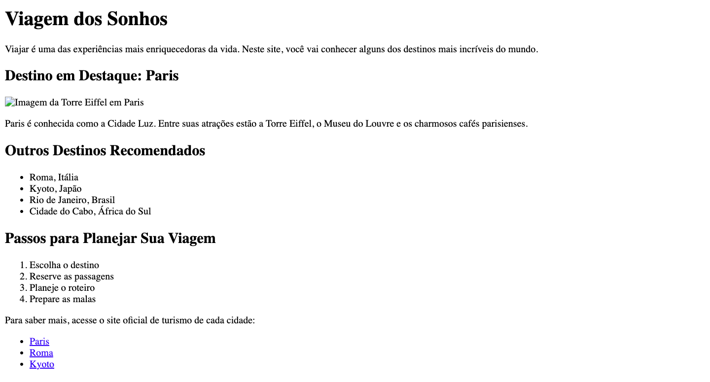
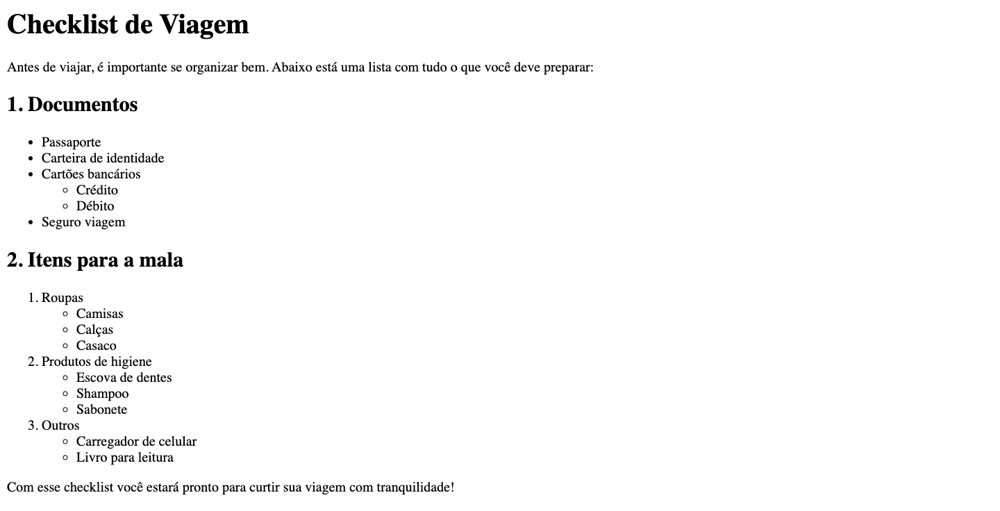

## 📝 Exercícios 

---

### 🔹 Exercício 1 – Viagem dos Sonhos
**Descrição:** Observe atentamente a página na imagem abaixo. Sua tarefa é recriar essa página utilizando apenas HTML. Certifique-se de incluir todos os elementos visuais presentes: títulos, parágrafos, imagens, listas (ordenadas e não ordenadas) e links.



---

### 🔹 Exercício 2 – Página Personalizada
**Descrição:** Agora é a sua vez de colocar a criatividade em prática! Crie uma página HTML do zero utilizando as tags que você aprendeu. Você pode escolher um dos temas sugeridos abaixo ou propor o seu próprio:

**1. Página Pessoal** 
Crie uma página de apresentação sobre você. Inclua seu nome, uma breve biografia, uma imagem sua ou de algo que represente você, uma lista com seus hobbies e links para sites que você gosta ou perfis sociais.

**2. Filme ou Série Favorita**
Crie uma página sobre um filme ou série que você gosta. Descreva a história, coloque uma imagem do pôster ou personagens, faça uma lista de motivos para assistir e adicione links para trailers ou mais informações.

**3. Top 3 Jogos Favoritos**
Monte uma lista dos seus 5 jogos preferidos. Para cada jogo, escreva um parágrafo explicando por que gosta dele, coloque uma imagem ou logo do jogo, e adicione links para trailers ou sites oficiais.

---

### 🔹 Exercício 3 – Checklist de Viagem
**Descrição:** Observe a página a seguir. Sua tarefa é recriar essa página utilizando as tags HTML. O foco deste exercício é o uso correto de listas aninhadas, ou seja, listas dentro de outras listas. Além disso, use títulos e parágrafos para estruturar bem o conteúdo.



---

### 🔹 Exercício 4 – Navegação entre Páginas HTML
**Descrição:**  Você recebeu um arquivo pronto chamado `index.html`. Sua tarefa é criar três novas páginas: `sobre.html`, `servicos.html` e `contato.html`. Cada uma dessas páginas deve conter:

- Um título e um parágrafo com conteúdo simples.
- Um link para **voltar à página inicial** (`index.html`).

Na página principal (`index.html`), já existem links, mas eles não apontam para as páginas ainda. Após criar os arquivos corretamente e fazer o link com o arquivo principal, você deve conseguir navegar entre as páginas clicando nos links.

**`index.html`**
```html
<!DOCTYPE html>
<html lang="pt-br">
<head>
  <meta charset="UTF-8" />
  <title>Meu Site Simples</title>
</head>
<body>
  <h1>Bem-vindo ao Meu Site</h1>

  <p>Esse é um site simples com navegação entre páginas. Clique nos links abaixo para visitar as seções:</p>

  <ul>
    <li><a href="#">Sobre</a></li>
    <li><a href="#">Serviços</a></li>
    <li><a href="#">Contato</a></li>
  </ul>
</body>
</html>
```

---

### 🔹 Exercício 5 – Agrupando Conteúdo com Divs
**Descrição:** Você recebeu o código de um site simples (veja o arquivo fornecido). Seu desafio é **organizar melhor o conteúdo utilizando a tag `<div>`** para criar uma estrutura mais clara.

A página está divida da seguinte forma:

1. **Cabeçalho** (título principal e navegação).
2. **Conteúdo principal** (seções, artigos e artigos relacionados).
3. **Conteúdo tangencial** (a dica rápida).
4. **Rodapé** (último parágrafo).

Insira **linhas horizontais (`<hr>`)** para separar visualmente cada uma dessas seções.

> 💡 **Dica**: Embora a tag `<div>` não produza efeito visual, ela é essencial para organizar o código e preparar o layout para futuros estilos com CSS.

**`index.html`**
```html
<!DOCTYPE html>
<html lang="pt-br">

<head>
  <meta charset="UTF-8" />
  <title>Blog Simples</title>
</head>

<body>

  <h1>Blog do Estudante</h1>
  <p>Bem-vindo ao blog com dicas e curiosidades sobre programação e tecnologia.</p>

  <a href="#">Início</a> |
  <a href="#">Artigos</a> |
  <a href="#">Contato</a>

  <h2>Último Artigo: Por que aprender HTML?</h2>
  <h3>Vantagens de aprender HTML</h3>
  <p>HTML é a base da construção de sites. Aprender HTML é o primeiro passo para se tornar um desenvolvedor web.</p>
  <ul>
    <li>Fácil de aprender</li>
    <li>Usado em todos os sites</li>
    <li>Essencial para o front-end</li>
  </ul>

  <h2>Artigos Relacionados</h2>
  <h3>Leituras recomendadas para iniciantes</h3>
  <ul>
    <li><a href="#">Como o CSS funciona</a></li>
    <li><a href="#">Primeiros passos com JavaScript</a></li>
    <li><a href="#">O que é a Web?</a></li>
  </ul>

  <h2>Dica Rápida</h2>
  <p>Salve seu progresso frequentemente e use indentação para organizar seu código!</p>

  <p>Blog do Estudante - Todos os direitos reservados © 2025</p>

</body>

</html>
```

---

### 🔹 Exercício 6 – Tags Semânticas
**Descrição:** Agora que você já organizou o conteúdo do site utilizando a tag `<div>`, chegou o momento de dar mais **significado semântico** à sua estrutura HTML.

Sua tarefa é **editar o exercício anterior** (Agrupando Conteúdo com Divs) e substituir as `<div>`s por **tags semânticas do HTML5**, `<header>`, `<main>`, `<footer>`, `<nav>`, `<section>`, `<article>`, `<aside>`.

---