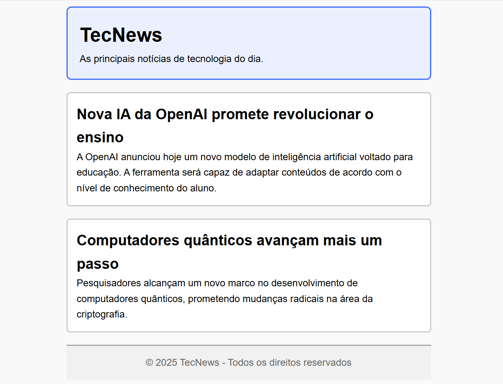

# 📝 Exercícios 

---

### 🔹 Exercício 1 – Tipos de CSS
**Descrição:** Neste exercício, você vai explorar as três formas de aplicar CSS em páginas HTML: **inline**, **interno** e **externo**. Seu objetivo é aplicar estilos visuais a um conteúdo realista sobre tecnologia, e entender as diferenças de praticidade, manutenção e reutilização entre as abordagens.

#### **Parte 1 – Estilo Inline**
**Instruções:** Você receberá um código HTML com conteúdo sobre tecnologia. Segue uma sugestão de elmentos para adicionar CSS e estilos que podem ser aplicados usando CSS inline (`style=""` diretamente nas tags):
- **Elementos**: `<body>`, `<h1>`, `<h2>`, `<h3>`, `<p>`
- **Estilos**: cor de fundo, cor de texto, tipo da fonte, alinhamento de texto, etc.

<br>

> ⚠️ Ao final, observe como é difícil reutilizar e manter o estilo com esse método.

<br>

`index.html`
```html
<!DOCTYPE html>
<html lang="pt-br">
<head>
  <meta charset="UTF-8">
  <title>Inteligência Artificial</title>
</head>
<body>
  <h1>A Revolução da Inteligência Artificial</h1>
  <p>A Inteligência Artificial (IA) tem transformado o mundo em diversos setores, desde a medicina até a educação.</p>

  <hr>

  <h2>Principais Aplicações em 2025</h2>
  <p>O uso da IA tem se expandido rapidamente, impactando desde operações empresariais até atividades domésticas.</p>

  <h3>Avanços no Cotidiano e na Indústria</h3>
  <p>Hoje, vemos a IA sendo aplicada em diagnósticos médicos precisos, assistentes virtuais personalizados, criação automatizada de conteúdo, manutenção preditiva na indústria e até em sistemas de recomendação para compras e entretenimento.</p>

  <hr>

  <h2>Desafios Éticos e Sociais</h2>
  <p>Com o avanço da IA, surgem novas responsabilidades sobre como ela deve ser desenvolvida e controlada para não causar danos à sociedade.</p>

  <h3>Responsabilidade e Transparência</h3>
  <p>À medida que a IA se torna mais presente no cotidiano, surgem questões sobre quem deve ser responsabilizado por decisões automatizadas e como garantir que os algoritmos sejam justos, transparentes e livres de preconceitos.</p>

  <hr>
</body>
</html>
```

<br>

#### Parte 2 – Estilo Interno 

**Instruções:** Use o mesmo conteúdo da **Parte 1**, mas agora aplique o CSS dentro de um bloco `<style>` no `<head>` do documento, usando seletores (`<body>`, `<h1>`, `<h2>`, `<h3>`, `<p>`).

<br>

> ⚠️ Você notará como é muito mais prático aplicar o mesmo estilo a vários elementos ao mesmo tempo.

<br>

#### Parte 3 – Estilo Externo
**Instruções:** Crie um novo arquivo chamado `style.css` e copie para ele o CSS da **Parte 2**. Use o HTML abaixo para testar o CSS externo. Faça a ligação do CSS com a página usando a tag `<link>` no `<head>`.

<br>

`index.html`
```html
<!DOCTYPE html>
<html lang="pt-br">
<head>
  <meta charset="UTF-8">
  <title>Impactos da Tecnologia</title>
</head>
<body>

  <h1>Como a Tecnologia Está Redefinindo Nossas Vidas</h1>
  <p>De carros autônomos a casas inteligentes, as inovações tecnológicas estão presentes em todas as partes do nosso dia a dia.</p>

  <hr>

  <h2>Impactos no Cotidiano</h2>
  <p>A tecnologia mudou hábitos e rotinas, tornando tarefas mais rápidas, acessíveis e conectadas.</p>
  <h3>Transformações na Comunicação e no Trabalho</h3>
  <p>Aplicativos de mensagens instantâneas, reuniões virtuais e plataformas de trabalho remoto se tornaram parte essencial da vida profissional e pessoal.</p>

  <hr>

  <h2>Desafios da Era Digital</h2>
  <p>Apesar das facilidades, o avanço tecnológico também trouxe questões que precisam ser enfrentadas com responsabilidade.</p>
  <h3>Privacidade e Segurança de Dados</h3>
  <p>Com a crescente coleta e armazenamento de informações pessoais, proteger a privacidade digital tornou-se um dos principais desafios do nosso tempo.</p>

  <hr>
</body>
</html>
```

<br>

#### Conclusão
- Qual das abordagens é mais prática em um projeto com várias páginas?
- Em qual situação o CSS inline pode ser útil?
- Por que separar estilo e conteúdo é uma boa prática?

---


### 🔹 Exercício 2 - Seletores

**Descrição:** Neste exercício, você vai praticar como aplicar estilos usando diferentes seletores CSS: por **tag** (como `<p>`, `<h1>`, etc.), **classe**, **id**, e **combinando** seletores. O objetivo é entender a diferença entre eles, aprender quando usar cada um e como combiná-los corretamente para estilizar elementos de forma eficiente.

Você receberá um código base com uma estrutura simples de um portal de notícias tecnológicas. A tarefa é aplicar estilos específicos usando os diferentes seletores.

`index.html`
```html

<!DOCTYPE html>
<html lang="pt-BR">
<head>
  <meta charset="UTF-8">
  <title>TecNews - Portal de Tecnologia</title>
</head>
<body>
  <header>
    <h1>TecNews</h1>
    <p>As novidades do mundo tech em um só lugar</p>
  </header>

  <hr>

  <main>
    <section>
        <h2>Linguagem Rust ganha popularidade</h2>
        <p>Rust tem sido apontada como uma das linguagens mais amadas pelos desenvolvedores.</p>

        <h3>Por que Rust se destaca?</h3>
        <p>Com foco em segurança de memória e alta performance, Rust vem conquistando grandes empresas e comunidades open source.</p>

        <h3>Adaptação do mercado e crescimento</h3>
        <p>Empresas como Microsoft e Amazon já utilizam Rust em projetos críticos, impulsionando ainda mais sua adoção no mercado global.</p>
    </section>

    <hr>

    <section>
        <h2>Avanços em Inteligência Artificial</h2>
        <p>Pesquisadores apresentam novos modelos generativos capazes de aprender com menos dados.</p>

        <h3>Aplicações práticas dos novos modelos</h3>
        <p>Esses avanços permitem melhorias em tradução automática, geração de imagens, chatbots mais inteligentes e diagnósticos médicos assistidos.</p>

        <h3>Desafios éticos e técnicos</h3>
        <p>Apesar do progresso, ainda existem preocupações com o viés algorítmico, uso indevido e necessidade de regulação responsável.</p>
    </section>
  </main>

  <hr>

  <footer>
    <p>© 2025 - TecNews. Todos os direitos reservados.</p>
  </footer>
</body>
</html>
```

<br>

#### Instruções
Você precisará seguir as seguintes regras e aplicar os seguintes estilos para:
- **Cabeçalho**: Aplique uma cor de sua escolha e centralize o texto.

* **Subtítulos**: Todos os elementos `<h2>` devem ter a mesma cor, assim como todos os elementos `<h3>`.

- **Parágrafos**: Todos os os parágrafos da página devem possuir o estilo padrão: texto justificado e  distância maior entre as linhas. 

* **Parágrafos por Seção**: A primeira seção (sobre a linguagem Rust) deve ter os parágrafos com uma cor diferente dos demais. A segunda seção (sobre Inteligência Artificial) também deve ter parágrafos com outra cor.

- **Rodapé**: Aplique uma cor de sua escolha e centralize o texto.

<br>

> 💡 **Dica**: não é necessário alterar o HTML, exceto para adicionar IDs e classes quando necessário para facilitar a aplicação de estilos.

---

### 🔹 Exercício 3 - Box Model
**Descrição:** Você foi convidado para colaborar com o layout de um portal fictício de notícias de tecnologia chamado **TecNews**. O objetivo é criar uma estrutura visual simples e organizada, utilizando os princípios do **Box Model** no CSS.

Abaixo está o **modelo de referência** do layout. Seu desafio é **replicar exatamente esse resultado** a partir do código fornecido:

`index.html`
```html
<!DOCTYPE html>
<html lang="pt-br">

<head>
  <meta charset="UTF-8">
  <title>TecNews - Destaques</title>
  <link rel="stylesheet" href="style.css">
</head>

<body>
  <div class="container">
    <header>
      <h1>TecNews</h1>
      <p>As principais notícias de tecnologia do dia.</p>
    </header>
    <main>
      <section class="noticia">
        <h2>Nova IA da OpenAI promete revolucionar o ensino</h2>
        <p>A OpenAI anunciou hoje um novo modelo de inteligência artificial voltado para educação. A ferramenta
            será capaz de adaptar conteúdos de acordo com o nível de conhecimento do aluno.</p>
      </section>

      <section class="noticia">
        <h2>Computadores quânticos avançam mais um passo</h2>
        <p>Pesquisadores alcançam um novo marco no desenvolvimento de computadores quânticos, prometendo
            mudanças radicais na área da criptografia.</p>
      </section>
    </main>

    <footer>
      <p>&copy; 2025 TecNews - Todos os direitos reservados</p>
    </footer>
  </div>
</body>

</html>
```

<br>

#### O que seu código deve conter
- Um seletor universal `*` para fazer o reset de `margin`, `padding` e aplicar `box-sizing: border-box`;

* Aplicação das propriedades do Box Model como `border`, `margin`, `padding` e `border-radius`;

- Uma estrutura com `<header>`, `<main>` com duas notícias, e `<footer>`, todos estilizados com bordas, espaçamentos internos e externos;

* Um container centralizado com **largura máxima** de `600px`.

<br>

#### Resultado Esperado



---