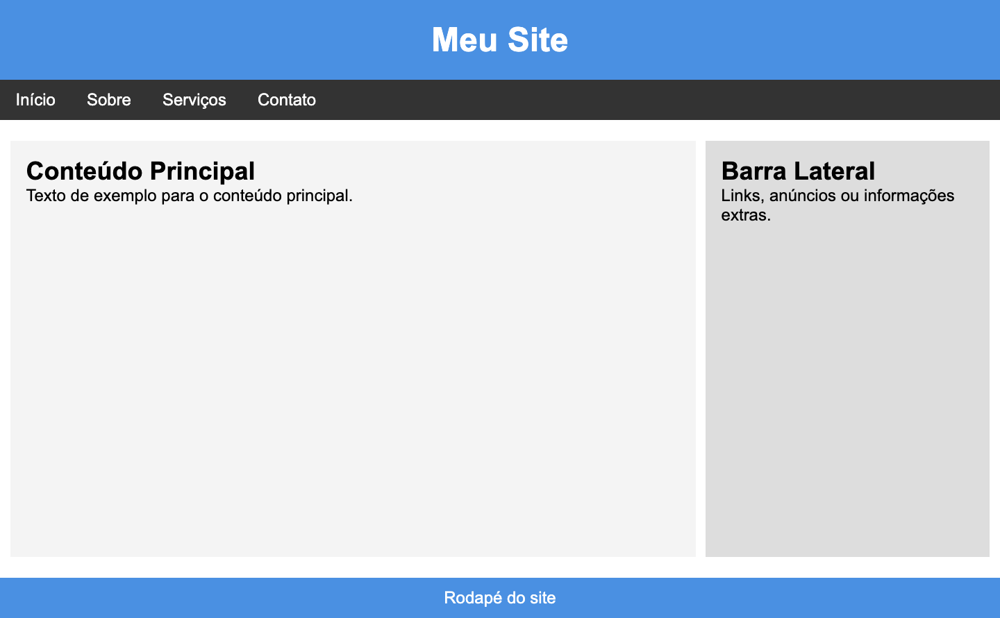
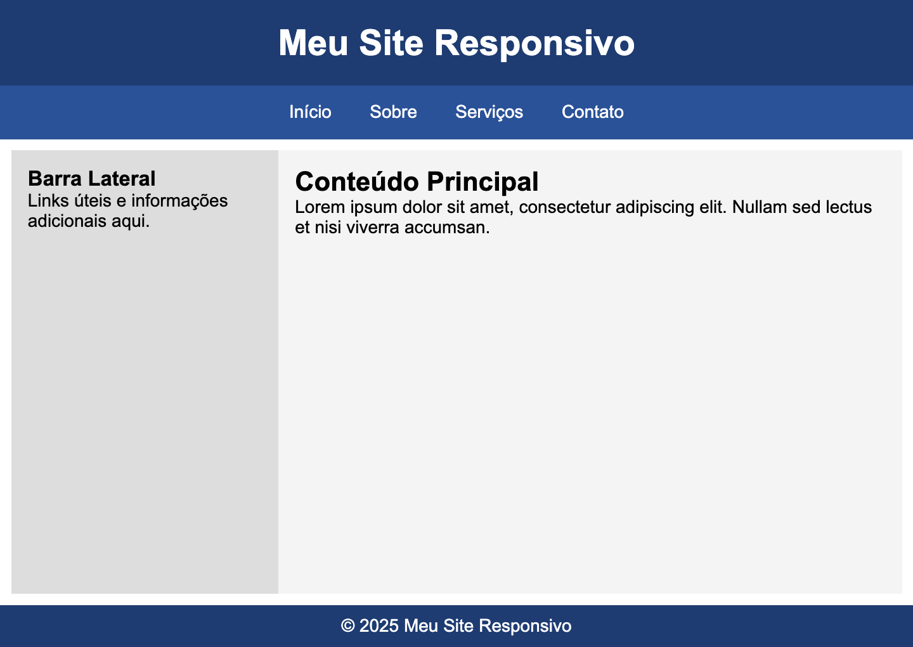
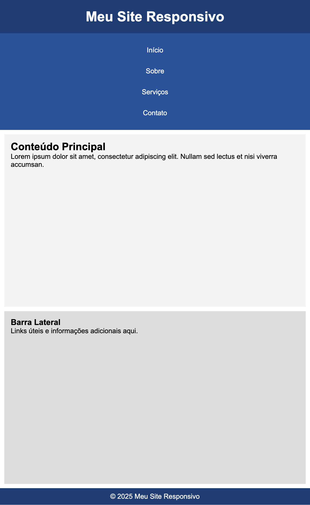

## 📝 Exercícios 

---

### 🔹 Exercício 1 - Catálogo de Produtos
**Descrição:** Você receberá uma página contendo 4 cards de produtos. Seu objetivo é fazer com que todos os cards fiquem alinhados na horizontal. Ao final da linha, quando a tela não couber todos, os produtos devem quebrar para a próxima linha automaticamente.

**Código Base (HTML):**
```html
<!DOCTYPE html>
<html lang="pt-BR">
<head>
<meta charset="UTF-8">
<meta name="viewport" content="width=device-width, initial-scale=1.0">
<title>Catálogo de Produtos</title>
<link rel="stylesheet" href="style.css">
</head>
<body>

  <h1>Catálogo de Produtos</h1>

  <div class="container">
    <div class="produto">
      
      <h3>Fone</h3>
      <p>R$ 99,90</p>
      <button>Comprar</button>
    </div>

    <div class="produto">
      
      <h3>Smartwatch</h3>
      <p>R$ 79,90</p>
      <button>Comprar</button>
    </div>

    <div class="produto">
      
      <h3>Mouse</h3>
      <p>R$ 59,90</p>
      <button>Comprar</button>
    </div>

    <div class="produto">
      
      <h3>Power Bank</h3>
      <p>R$ 89,90</p>
      <button>Comprar</button>
    </div>
  </div>
</body>
</html>
```

<br>

**Código Base (CSS):**
```css
body {
  font-family: Arial, sans-serif;
  background-color: #f4f4f4;
  padding: 20px;
}

h1 {
  text-align: center;
}

.container {
  max-width: 1000px;
  margin: 0 auto;
  border: 1px solid #ccc;
}

.produto {
  width: 200px;
  background-color: white;
  padding: 10px;
  margin: 10px;
  border: 1px solid #ccc;
  border-radius: 8px;
  text-align: center;
}

.produto img {
  width: 100%;
  border-radius: 4px;
}

.produto h3 {
  margin: 10px 0 5px;
  font-size: 18px;
}

.produto p {
  color: #555;
}

.produto button {
  background-color: #28a745;
  color: white;
  border: none;
  padding: 8px 12px;
  border-radius: 4px;
  cursor: pointer;
}

.produto button:hover {
  background-color: #218838;
}
```

<br>

**Resultado Esperado:**


<br>
<br>

**Instruções:**
- Use `float: left` para alinhar os cards lado a lado.
- Use `overflow: auto` no container para fazer com que os cards fiquem dentro do elemento pai.

---

### 🔹 Exercício 2 - Criando um layout simples
**Descrição:** O objetivo deste exercício é criar um layout básico de página usando **float** e **clear** para organizar os elementos.

Você irá receber uma página com as seguintes áreas:

- Header: cabeçalho ocupando 100% da largura
- Nav: barra de navegação abaixo do cabeçalho
- Main: dividido em conteúdo principal, que ocupara 70% da largura da tela e ficará a direita e barra lateral, que ocupara 29% da largura da tela e ficará a esquerda.
- Footer: rodapé ocupando 100% da largura e aparecendo abaixo de tudo

**Código Base (HTML):**
```html
<!DOCTYPE html>
<html lang="pt-BR">
<head>
  <meta charset="UTF-8">
  <meta name="viewport" content="width=device-width, initial-scale=1.0">
  <title>Layout com Float e Clear</title>
  <link rel="stylesheet" href="style.css">
</head>
<body>
  <header>
    <h1>Meu Site</h1>
  </header>

  <nav>
    <ul>
      <li><a href="#">Início</a></li>
      <li><a href="#">Sobre</a></li>
      <li><a href="#">Serviços</a></li>
      <li><a href="#">Contato</a></li>
    </ul>
  </nav>

  <main>
    <section class="conteudo">
      <h2>Conteúdo Principal</h2>
      <p>Texto de exemplo para o conteúdo principal.</p>
    </section>

    <aside class="barra-lateral">
      <h2>Barra Lateral</h2>
      <p>Links, anúncios ou informações extras.</p>
    </aside>
  </main>

  <footer>
    <p>Rodapé do site</p>
  </footer>
</body>
</html>
```

<br>

**Código Base (CSS):**
```css
* {
  margin: 0;
  padding: 0;
  box-sizing: border-box;
}

body {
  font-family: Arial, sans-serif;
}

header {
  background-color: #4A90E2;
  color: white;
  padding: 20px;
  text-align: center;
}

nav {
  background-color: #333;
}

nav ul {
  list-style: none;
  display: flex;
}

nav li {
  margin: 0;
}

nav a {
  display: block;
  padding: 10px 15px;
  color: white;
  text-decoration: none;
}

nav a:hover {
  background-color: #555;
}

main {
  margin: 10px 0;
  padding: 10px;
}

.conteudo {
  min-height: 400px;
  background-color: #f4f4f4;
  padding: 15px;
}

.barra-lateral {
  min-height: 400px;
  background-color: #ddd;
  padding: 15px;
}

footer {
  background-color: #4A90E2;
  color: white;
  text-align: center;
  padding: 10px;
}
```

<br>

**Resultado Esperado:**



<br>
<br>

**Instruções:**
- Use `float: left` e `float: right` para posicionar o conteúdo e a barra lateral lado a lado.
- Defina larguras adequadas para o conteúdo e a barra lateral.
- Use `overflow: auto` para garantir que o conteúdo faça parte do `main`

---

### 🔹 Exercício 3 - Layout Responsivo
**Descrição:** Neste exercício, você vai criar uma página simples que se adapta a diferentes larguras de tela utilizando Media Queries no CSS. O objetivo é treinar a construção de layouts responsivos, onde o design muda para melhorar a experiência do usuário em dispositivos com tamanhos variados.

**Código Base (HTML):**
```html
<!DOCTYPE html>
<html lang="pt-BR">
<head>
    <meta charset="UTF-8">
    <meta name="viewport" content="width=device-width, initial-scale=1.0">
    <title>Layout Responsivo</title>
    <link rel="stylesheet" href="style.css">
</head>
<body>
    <header>
        <h1>Meu Site Responsivo</h1>
    </header>

    <nav>
        <ul>
            <li><a href="#">Início</a></li>
            <li><a href="#">Sobre</a></li>
            <li><a href="#">Serviços</a></li>
            <li><a href="#">Contato</a></li>
        </ul>
    </nav>

    <main>
        <section>
            <h2>Conteúdo Principal</h2>
            <p>Lorem ipsum dolor sit amet, consectetur adipiscing elit. Nullam sed lectus et nisi viverra accumsan.</p>
        </section>

        <aside>
            <h3>Barra Lateral</h3>
            <p>Links úteis e informações adicionais aqui.</p>
        </aside>
    </main>

    <footer>
        <p>© 2025 Meu Site Responsivo</p>
    </footer>
</body>
</html>
```

<br>

**Código Base (CSS):**
```css
* {
  font-family: Arial, sans-serif;
  margin: 0;
  padding: 0;
  box-sizing: border-box;
}


header {
  background-color: #1e3c72;
  color: white;
  text-align: center;
  padding: 20px
}

nav {
  background-color: #2a5298;
  padding: 15px;
}

nav ul {
  list-style: none;
  padding: 0;
  margin: 0;
  text-align: center;
}

nav ul li {
  text-align: center;
  display: inline;
  padding: 15px;
}

nav a {
  color: white;
  text-decoration: none;
}

nav li:hover {
  background-color: #3568c1;
}

main {
  padding: 10px;
  overflow: auto;
}

section {
  background: #f4f4f4;
  padding: 15px;
  min-height: 400px;
  width: 70%;
  float: right;

}

aside {
  background: #ddd;
  padding: 15px;
  min-height: 400px;
  width: 30%;
}

footer {
  background: #1e3c72;
  padding: 10px;
  color: white;
  text-align: center;
  clear: both;
}
```

<br>

**Resultado Esperado:**

**Desktop:**


**Mobile:**


<br>

**Instruções:**

* Adicione uma consulta de mídia (`@media`) que altere o layout para telas com largura **máxima de 767px**.

- Dentro da media query, você deverá:

  - Fazer com que os itens do menu sejam exibidos em coluna (um embaixo do outro).

  - Ajustar a seção principal (section) para ocupar 100% da largura, removendo o float.

  - Ajustar a barra lateral (aside) para ocupar 100% da largura.

* (Opcional) Aproveite para melhorar a experiência visual:

  - Reduza o tamanho da fonte para telas menores.

  - Aumente o espaçamento entre os elementos para melhorar a legibilidade.

---

