## 🔵 Tabelas

<div style="height: 1px"></div>

### 🔹 Introdução as Tabelas

<div style="height: 1px"></div>

#### Tabelas em HTML
As tabelas em HTML são estruturas usadas para **organizar dados em linhas e colunas**, facilitando a visualização de informações de forma clara e organizada. Elas são muito comuns em páginas web para exibir planilhas, horários, listas de produtos, resultados e qualquer conjunto de dados que se beneficie de uma disposição tabular.

<div style="height: 1px"></div>

#### O que é uma tabela?
Uma tabela é formada por **linhas** e **colunas**, formando células onde cada item de informação é colocado. Cada célula pode conter texto, números, links ou outros elementos HTML. O objetivo principal é **apresentar dados de forma estruturada**, permitindo que o usuário entenda rapidamente a relação entre diferentes informações.

<div style="height: 15px"></div>

**Exemplo:**

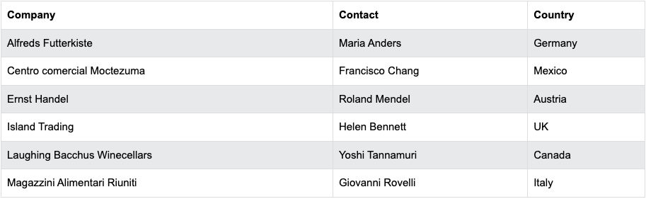

<div style="height: 5px"></div>

#### Principais tags de uma tabela

| Elemento        | Descrição                                                                 |
|-----------------|---------------------------------------------------------------------------|
| `<table>`       | Representa **toda a tabela**. É o elemento raiz que engloba todas as linhas e células. |
| `<tr>` (table row) | Define **uma linha** da tabela. Cada linha contém uma ou mais células.       |
| `<td>` (table data) | Representa **uma célula** de dados dentro de uma linha. Usada para valores comuns, como nomes, números ou qualquer conteúdo. |
| `<th>` (table header) | Representa **uma célula de cabeçalho**. Geralmente é exibida em negrito e centralizada. Indica o título ou a categoria da coluna ou linha. |

<div style="height: 15px"></div>

#### Exemplo simples
**HTML:**
```html
<table border="1">
  <tr>
    <th>Nome</th>
    <th>Idade</th>
    <th>Cidade</th>
  </tr>
  <tr>
    <td>Ana</td>
    <td>25</td>
    <td>São Paulo</td>
  </tr>
  <tr>
    <td>Bruno</td>
    <td>30</td>
    <td>Rio de Janeiro</td>
  </tr>
  <tr>
    <td>Carla</td>
    <td>28</td>
    <td>Belo Horizonte</td>
  </tr>
</table>
```

<div style="height: 10px"></div>

**Resultado:**
<table>
  <tr>
    <th>Nome</th>
    <th>Idade</th>
    <th>Cidade</th>
  </tr>
  <tr>
    <td>Ana</td>
    <td>25</td>
    <td>São Paulo</td>
  </tr>
  <tr>
    <td>Bruno</td>
    <td>30</td>
    <td>Rio de Janeiro</td>
  </tr>
  <tr>
    <td>Carla</td>
    <td>28</td>
    <td>Belo Horizonte</td>
  </tr>
</table>

<div style="height: 10px"></div>

**Explicação:**
Nesse exemplo,

- A primeira linha `<tr>` contém células de cabeçalho `<th>`: Nome, Idade e Cidade.

- As linhas seguintes contêm células de dados `<td>` com informações correspondentes.

- O atributo `border="1"` adiciona uma borda simples à tabela para facilitar a visualização (útil para estudo e exemplos iniciais).

<div style="height: 10px"></div>

**Dica:** Tabelas devem ser usadas para **dados tabulares**, e não para layout de páginas, que hoje é melhor feito com CSS, Flexbox ou Grid.

---

### 🔹 Estilizando Tabelas com CSS
Por padrão, as tabelas em HTML não possuem bordas visíveis, espaçamento entre células ou alinhamento específico do conteúdo. Para tornar as tabelas mais legíveis e agradáveis visualmente, podemos usar CSS para controlar **borda**, **tamanho**, **espaçamento** e **alinhamento das células**.

<div style="height: 1px"></div>

#### Tabela Inicial (Sem Estilo)

```html
<table>
  <tr>
    <th>Nome</th>
    <th>Idade</th>
    <th>Cidade</th>
  </tr>
  <tr>
    <td>Ana</td>
    <td>25</td>
    <td>São Paulo</td>
  </tr>
  <tr>
    <td>Bruno</td>
    <td>30</td>
    <td>Rio de Janeiro</td>
  </tr>
  <tr>
    <td>Carla</td>
    <td>28</td>
    <td>Belo Horizonte</td>
  </tr>
</table>
```

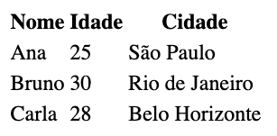

<div style="height: 1px"></div>

#### 1. Bordas
A propriedade `border` permite definir bordas para a tabela e suas células. É possível especificar **espessura**, **estilo** e **cor**:

```css
table {
  border: 2px solid #333; /* borda da tabela */
  border-collapse: collapse; /* evita bordas duplas entre células */
}

td, th {
  border: 1px solid #666; /* bordas das células */
  padding: 8px; /* espaço interno das células */
}
```
**Resultado:**

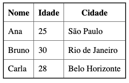

<div style="height: 10px"></div>

- `border-collapse: collapse;` faz com que as bordas das células se unam à borda da tabela, evitando duplicação.

- `padding` cria **espaço interno**, afastando o conteúdo da borda da célula.

<div style="height: 10px"></div>

#### 2. Tamanho

Podemos controlar o tamanho da tabela ou das células usando `width` e `height`:

```css
table {
  width: 80%; /* largura da tabela em relação ao container */
}

td, th {
  height: 50px; /* altura das células */
}
```

**Resultado:**

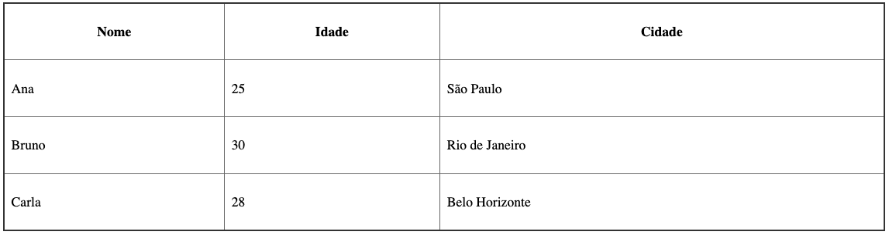

<div style="height: 10px"></div>

- A largura da tabela pode ser em **porcentagem** (relativa ao container) ou **pixels**.

- A altura das células garante consistência visual, mesmo que o conteúdo seja pequeno.

<div style="height: 10px"></div>

#### 3. Espaçamento

Além do `padding` dentro das células, podemos controlar o espaço **entre células** com `border-spacing` (apenas quando não usamos `border-collapse: collapse`):

```css
table {
  border-spacing: 10px 5px; /* 10px horizontal, 5px vertical */
}
```

**Resultado:**

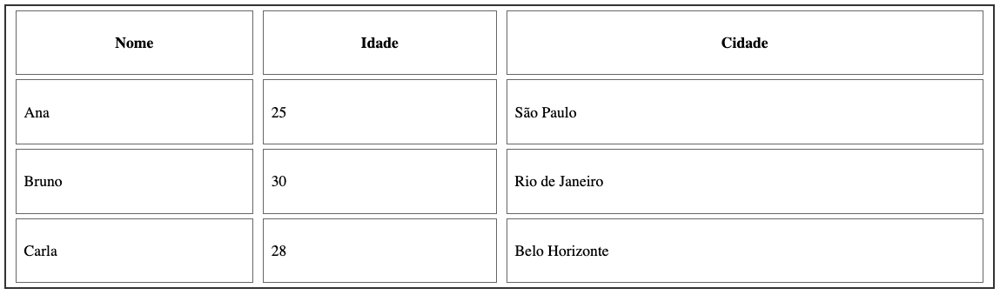

<div style="height: 10px"></div>

#### 4. Alinhamento do conteúdo da célula

Para melhorar a leitura, é importante alinhar o conteúdo:

```css
th {
  text-align: center; /* horizontal */
  vertical-align: middle; /* vertical */
}

td {
  text-align: left;
  vertical-align: top;
}
```

**Resultado:**

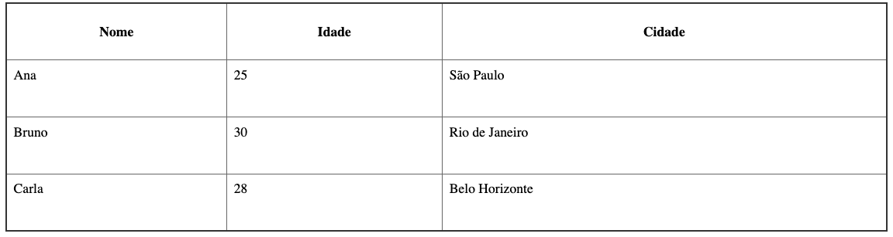

<div style="height: 10px"></div>

- `text-align` controla o alinhamento **horizontal**: `left`, `center` ou `right`.

- `vertical-align` controla o alinhamento **vertical**: `top`, `middle`, `bottom`.

<div style="height: 10px"></div>

#### Exemplo completo:

<div style="height: 10px"></div>

**HTML e CSS:**
```html
<!DOCTYPE html>
<html lang="pt-br">
<head>
  <meta charset="UTF-8">
  <meta name="viewport" content="width=device-width, initial-scale=1.0">
  <title>Tabelas</title>
  <style>
    table {
      width: 70%;
      border: 2px solid #333;
      border-collapse: collapse;
      margin: 20px auto;
    }

    th, td {
      border: 1px solid #666;
      padding: 10px;
    }

    th {
      text-align: center;
      vertical-align: middle;
      background-color: #f2f2f2;
    }

    td {
      text-align: left;
      vertical-align: top;
    }
  </style>
</head>
<body>
  <table>
  <tr>
    <th>Nome</th>
    <th>Idade</th>
    <th>Cidade</th>
  </tr>
  <tr>
    <td>Ana</td>
    <td>25</td>
    <td>São Paulo</td>
  </tr>
  <tr>
    <td>Bruno</td>
    <td>30</td>
    <td>Rio de Janeiro</td>
  </tr>
  <tr>
    <td>Carla</td>
    <td>28</td>
    <td>Belo Horizonte</td>
  </tr>
</table>
</body>
</html>
```

<div style="height: 20px"></div>

**Resulado:**

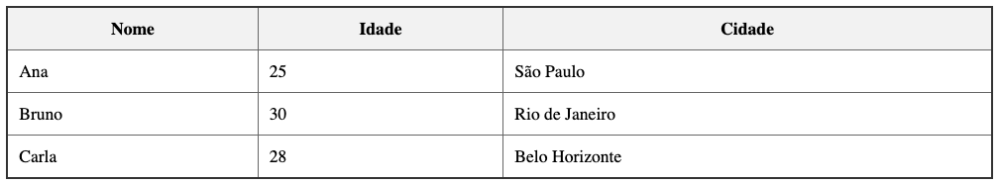

---

### 🔹 Elementos Complementares de Tabelas

Além das tags básicas `<table>`, `<tr>`, `<td>` e `<th>`, o HTML oferece elementos que ajudam a **organizar melhor o conteúdo das tabelas**, tornando-as mais semânticas e fáceis de estilizar. Os principais são:

#### 1. `<thead>` (table head)

- Define o **cabeçalho da tabela**.
- Agrupa uma ou mais linhas de cabeçalho, geralmente contendo `<th>`.
- Facilita a estilização de todo o cabeçalho de forma uniforme e melhora a acessibilidade, já que leitores de tela podem identificar facilmente a seção de títulos.

<div style="height: 1px"></div>

#### 2. `<tbody>` (table body)

- Define o **corpo principal da tabela**, contendo a maioria dos dados.
- Agrupar linhas dentro do `<tbody>` ajuda na organização e permite aplicar estilos ou scripts apenas ao corpo da tabela.

<div style="height: 1px"></div>

#### 3. `<tfoot>` (table footer)

- Define o **rodapé da tabela**, normalmente usado para somas, totais ou informações resumidas.
- É especialmente útil quando a tabela é longa, porque o `<tfoot>` pode ser inserido antes do `<tbody>` no HTML, mas renderizado no final da tabela no navegador, garantindo compatibilidade com algumas funcionalidades como impressão ou tabelas com rolagem.

<div style="height: 1px"></div>

#### Exemplo

**HTML:**
```html
<table border="1">
  <thead>
    <tr>
      <th>Produto</th>
      <th>Quantidade</th>
      <th>Preço</th>
    </tr>
  </thead>
  <tbody>
    <tr>
      <td>Caneta</td>
      <td>10</td>
      <td>R$ 1,50</td>
    </tr>
    <tr>
      <td>Caderno</td>
      <td>5</td>
      <td>R$ 12,00</td>
    </tr>
  </tbody>
  <tfoot>
    <tr>
      <td colspan="2">Total</td>
      <td>R$ 69,00</td>
    </tr>
  </tfoot>
</table>
```

<div style="height: 10px"></div>

**Resultado:**
<table>
  <thead>
    <tr>
      <th>Produto</th>
      <th>Quantidade</th>
      <th>Preço</th>
    </tr>
  </thead>
  <tbody>
    <tr>
      <td>Caneta</td>
      <td>10</td>
      <td>R$ 1,50</td>
    </tr>
    <tr>
      <td>Caderno</td>
      <td>5</td>
      <td>R$ 12,00</td>
    </tr>
  </tbody>
  <tfoot>
    <tr>
      <td colspan="2">Total</td>
      <td>R$ 69,00</td>
    </tr>
  </tfoot>
</table>

<div style="height: 20px"></div>

**Dica:** Embora `<thead>`, `<tbody>` e `<tfoot>` não sejam obrigatórios, usá-los torna a tabela mais organizada, acessível e fácil de estilizar.


---

### 🔹 Mesclagem de Células 

Em tabelas HTML, às vezes é necessário que uma célula ocupe **mais de uma coluna ou mais de uma linha**. Para isso, utilizamos os atributos `colspan` e `rowspan` nas células (`<td>` ou `<th>`).

<div style="height: 1px"></div>

#### Tabela Inicial

```html
<style>
  table {
    width: 400px;
    border-collapse: collapse;
  }

  td {
    border: 1px solid black;
    padding: 10px;
    text-align: center;
    
  }
</style>

<table>
  <tr>
    <td>A</td>
    <td>B</td>
    <td>C</td>
  </tr>
  <tr>
    <td colspan="2">E</td>
    <td>G</td>
  </tr>
  <tr>
    <td>H</td>
    <td>I</td>
    <td>J</td>
  </tr>
</table>
```

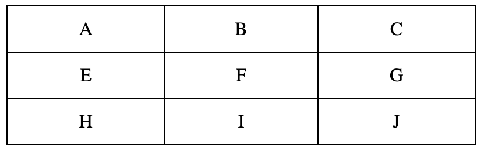

<div style="height: 1px"></div>

#### 1. `colspan`

- Permite que uma célula se estenda **horizontalmente**, ocupando mais de uma coluna.
- Valor: número de colunas que a célula deve ocupar.

```html
<table>
  <tr>
    <td>A</td>
    <td>B</td>
    <td>C</td>
  </tr>
  <tr>
    <td colspan="2">E</td>
    <td>G</td>
  </tr>
  <tr>
    <td>H</td>
    <td>I</td>
    <td>J</td>
  </tr>
</table>
```

<div style="height: 10px"></div>

**Resultado:**

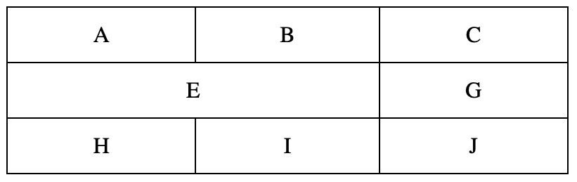

- No exemplo acima, a célula que continha a letra F foi removida, e a célula com a letra E foi expandida para ocupar o espaço que ficou vago.

<div style="height: 10px"></div>

#### 2. `rowspan`

- Permite que uma célula se estenda **verticalmente**, ocupando mais de uma linha.
- Valor: número de linhas que a célula deve ocupar.

```html
<table>
  <tr>
    <td>A</td>
    <td>B</td>
    <td>C</td>
  </tr>
  <tr>
    <td>E</td>
    <td>F</td>
    <td rowspan="2">G</td>
  </tr>
  <tr>
    <td>H</td>
    <td>I</td>
  </tr>
</table>
```

<div style="height: 10px"></div>

**Resultado:**

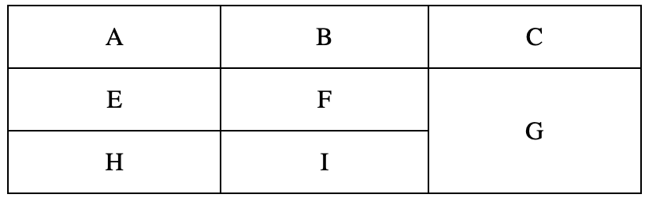

- No exemplo acima, a célula que continha a letra J foi removida, e a célula com a letra G foi expandida para ocupar o espaço que ficou vago.

<div style="height: 10px"></div>

#### Exemplo completo

<div style="height: 10px"></div>

**HTML e CSS:**
```html
<!DOCTYPE html>
<html lang="pt-br">
<head>
  <meta charset="UTF-8">
  <meta name="viewport" content="width=device-width, initial-scale=1.0">
  <title>Tabelas</title>
     <style>
      table {
        width: 400px;
        border-collapse: collapse;
      }

      th,td {
        border: 1px solid black;
        padding: 10px;
        text-align: center;
      }
    </style>
</head>
<body>

<table>
  <tr>
    <th>Produto</th>
    <th>Quantidade</th>
    <th>Preço</th>
  </tr>
  <tr>
    <td rowspan="2">Caneta</td>
    <td>10</td>
    <td>R$ 1,50</td>
  </tr>
  <tr>
    <td>15</td>
    <td>R$ 2,25</td>
  </tr>
  <tr>
    <td>Caderno</td>
    <td colspan="2">R$ 12,00</td>
  </tr>
</table>
</body>
</html>
```

<div style="height: 10px"></div>

**Resultado:**

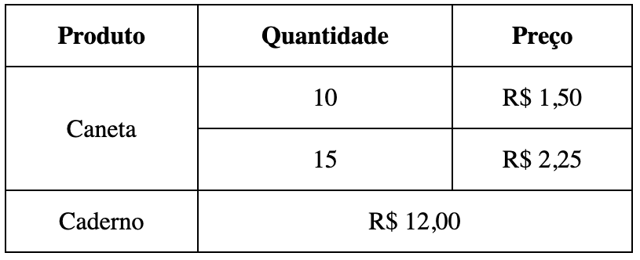

<div style="height: 10px"></div>

- A célula com `rowspan="2"` ocupa duas linhas verticalmente, agrupando informações relacionadas.

- A célula com `colspan="2"` ocupa duas colunas horizontalmente, combinando dados de quantidade e preço em uma única célula.

<div style="height: 10px"></div>

**Dica:** Mesclar células ajuda a **organizar visualmente tabelas complexas**, mas deve ser usado com cuidado para manter a clareza e a legibilidade dos dados.

---

### 🔹 Legenda de Tabelas

O elemento `<caption>` permite adicionar uma **legenda ou título** para a tabela, ajudando a identificar rapidamente o conteúdo e aumentando a **acessibilidade**.

- Deve ser colocado **logo após a tag** `<table>`.
- Por padrão, é exibido acima da tabela, mas pode ser posicionado com CSS se necessário.

**Exemplo:**
```html
<!DOCTYPE html>
<html lang="pt-br">
<head>
  <meta charset="UTF-8">
  <meta name="viewport" content="width=device-width, initial-scale=1.0">
  <title>Tabelas</title>
     <style>
      table {
        width: 400px;
        border-collapse: collapse;
      }

      caption {
        padding: 10px;
        background-color: black;
        color: white;
      }

      th,td {
        border: 1px solid black;
        padding: 10px;
        text-align: center;
      }
    </style>
</head>
<body>

<table>
  <caption>Vendas do Mês de Agosto</caption>
  <tr>
    <th>Produto</th>
    <th>Quantidade</th>
    <th>Preço</th>
  </tr>
  <tr>
    <td>Caneta</td>
    <td>10</td>
    <td>R$ 1,50</td>
  </tr>
</table>
</body>
</html>
```

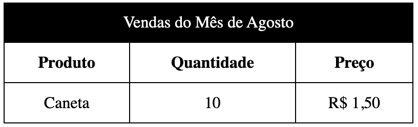

<div style="height: 10px"></div>

- O texto *“Vendas do Mês de Agosto”* aparece como título da tabela.
- Melhora a compreensão do conteúdo, especialmente para leitores de tela.

---

### 🔹 Escopo de Cabeçalhos

O atributo `scope` é usado em células de cabeçalho `<th>` para indicar **quais células a coluna ou linha influencia**.
Isso é importante para **acessibilidade**, pois leitores de tela conseguem entender melhor a relação entre cabeçalhos e dados.

<div style="height: 10px"></div>

**Valores possíveis:**
| Elemento       | Função                                                       |
|----------------|--------------------------------------------------------------|
| `col`          | O `<th>` é cabeçalho da coluna.                             |
| `row`          | O `<th>` é cabeçalho da linha.                              |
| `colgroup`     | Cabeçalho de um grupo de colunas.                            |
| `rowgroup`     | Cabeçalho de um grupo de linhas.                             |

<div style="height: 10px"></div>

**Exemplo:**
```html
<!DOCTYPE html>
<html lang="pt-br">
<head>
  <meta charset="UTF-8">
  <meta name="viewport" content="width=device-width, initial-scale=1.0">
  <title>Tabelas</title>
     <style>
      table {
        width: 400px;
        border-collapse: collapse;
      }

      caption {
        padding: 10px;
        background-color: black;
        color: white;
      }

      th,td {
        border: 1px solid black;
        padding: 10px;
        text-align: center;
      }
    </style>
</head>
<body>

<table>
  <caption>Notas dos Alunos</caption>
  <tr>
    <th scope="col">Aluno</th>
    <th scope="col">Matemática</th>
    <th scope="col">Português</th>
  </tr>
  <tr>
    <th scope="row">Ana</th>
    <td>8</td>
    <td>9</td>
  </tr>
  <tr>
    <th scope="row">Bruno</th>
    <td>7</td>
    <td>6</td>
  </tr>
</table>

</body>
</html>
```

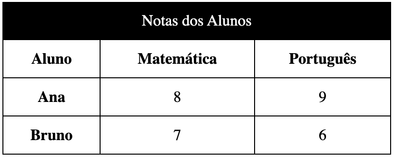

<div style="height: 10px"></div>

- Cada `<th>` da primeira linha tem `scope="col"`, indicando que é o cabeçalho de sua coluna.

- Cada `<th>` da primeira célula das linhas de dados tem `scope="row"`, indicando que é cabeçalho da linha.

Isso melhora a leitura e compreensão, principalmente em leitores de tela, e também ajuda na manutenção da tabela.

---

### 🔹 Agrupando e Estilizando Colunas

As tags `<colgroup>` e `<col>` permitem **definir grupos de colunas e aplicar estilos a elas**, sem precisar adicionar classes ou estilos diretamente em cada célula. Isso é útil para tabelas grandes ou quando várias colunas compartilham a mesma aparência.

<div style="height: 1px"></div>

#### 1. `<colgroup>`

- Agrupa uma ou mais colunas de uma tabela.
- Pode conter múltiplos elementos `<col>` ou usar o atributo span para abranger várias colunas.
- Geralmente usado antes do `<thead>`, `<tbody>` ou `<tfoot>`.

<div style="height: 1px"></div>

#### 2. `<col>`

- Representa **uma coluna individual** dentro de um `<colgroup>`.
- Pode ter estilos próprios (cor, largura, borda, etc.).
- O atributo `span` **define quantas colunas consecutivas** o `<col>` deve abranger.

<div style="height: 1px"></div>

#### Exemplo completo
```html
<!DOCTYPE html>
<html lang="pt-br">
<head>
  <meta charset="UTF-8">
  <meta name="viewport" content="width=device-width, initial-scale=1.0">
  <title>Tabelas</title>
     <style>
      table {
        width: 400px;
        border-collapse: collapse;
      }

      caption {
        padding: 10px;
        background-color: black;
        color: white;
      }

      th,td {
        border: 1px solid black;
        padding: 10px;
        text-align: center;
      }
    </style>
</head>
<body>

<table>
  <caption>Vendas do Mês</caption>

  <colgroup>
    <col style="background-color: #f2f2f2; width: 30%;">
    <col span="2" style="background-color: #e6f7ff; width: 35%;">
  </colgroup>

  <thead>
    <tr>
      <th>Produto</th>
      <th>Quantidade</th>
      <th>Preço</th>
    </tr>
  </thead>

  <tbody>
    <tr>
      <td>Caneta</td>
      <td>10</td>
      <td>R$ 1,50</td>
    </tr>
    <tr>
      <td>Caderno</td>
      <td>5</td>
      <td>R$ 12,00</td>
    </tr>
  </tbody>

  <tfoot>
    <tr>
      <td colspan="2">Total</td>
      <td>R$ 69,00</td>
    </tr>
  </tfoot>
</table>

</body>
</html>
```

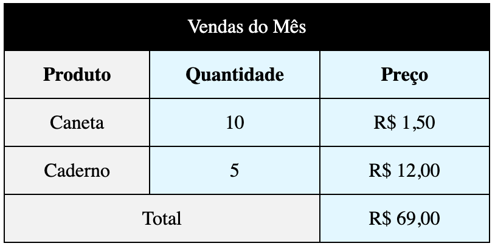

---