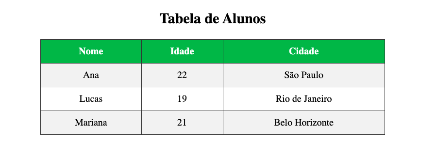
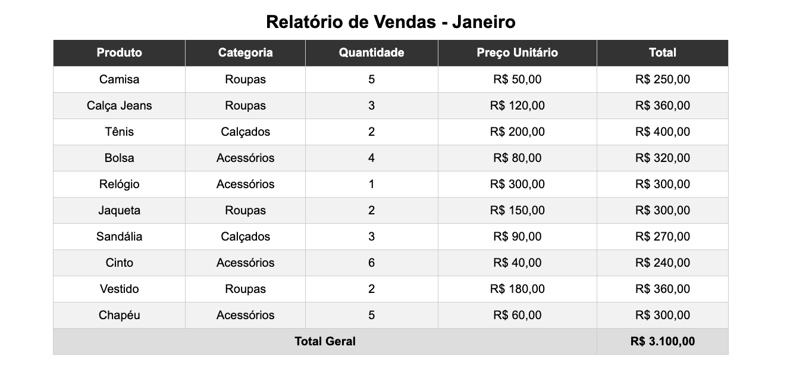
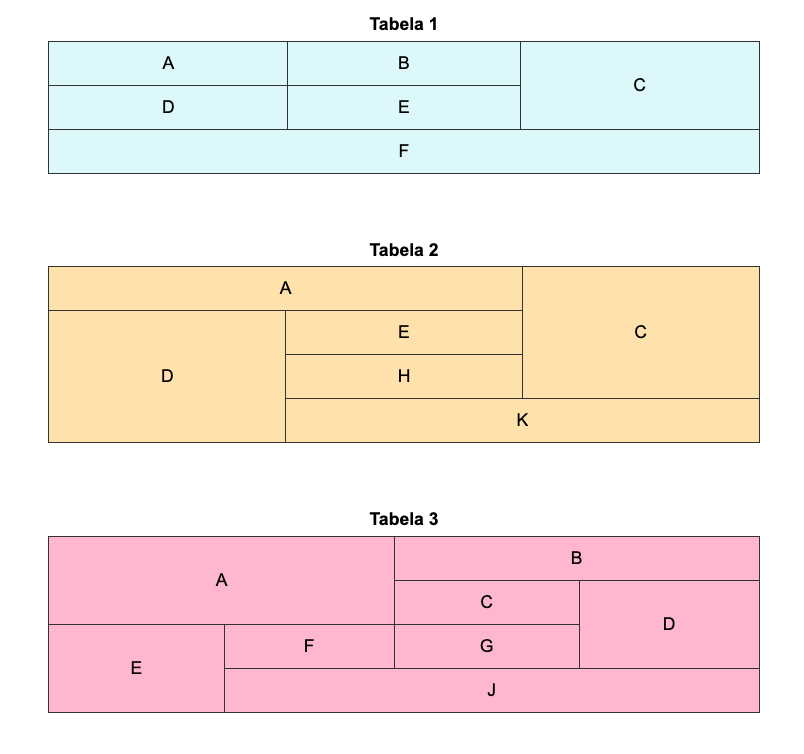
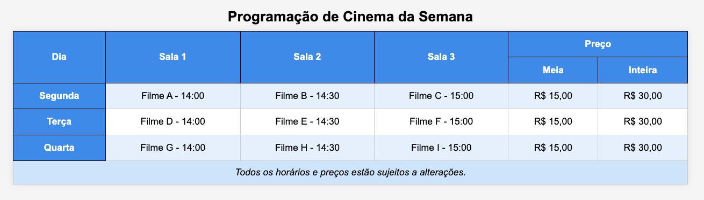
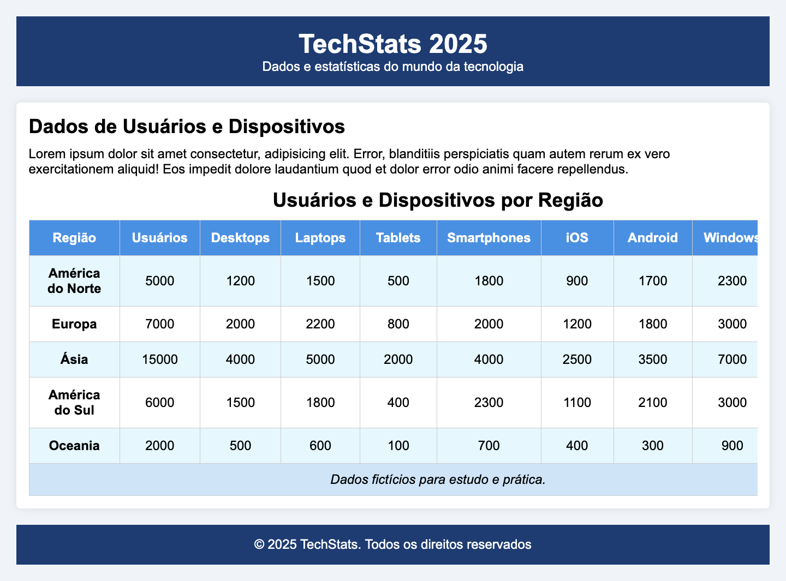

## 📝 Exercícios 

---

### 🔹 Exercício 1 - Tabela de Alunos

**Descrição:** Você deverá criar uma tabela simples em HTML para exibir informações fictícias. O objetivo é praticar as principais tags relacionadas a tabelas e aplicar estilos básicos em CSS para melhorar a aparência.

**Resultado Esperado:**



**Instruções:**
- Crie uma tabela usando a tag `<table>`.

* Use a tag `<tr>` para definir pelo menos 3 linhas.

- Defina os títulos das colunas utilizando `<th>`.

* Preencha as demais células com `<td>`.

- Aplique estilos em CSS para:
  - Adicionar borda em toda a tabela e nas células.
  - Adicionar espaçamento interno (padding) nas células.
  - Definir uma cor de fundo diferente para o cabeçalho (`<th>`).
  - Centralizar o texto dentro da tabela.

* A tabela tem a largura de metade da tela e deve está centralizada. 

---

### 🔹 Exercício 2 - Relatório de Vendas 

**Descrição:** Você deverá aplicar od elementos complementares para tabelas (thead, tbody, tfoot, caption) e aplicar estilos úteis em tabelas grandes, como efeito zebrado e cabeçalho fixo.

**Resultado Esperado:**



**Instruções:**

- Crie uma tabela que represente o relatório de vendas de uma loja.

* Use as tags:

  - `<caption>` para o título da tabela.

  - `<thead>` para o cabeçalho.

  - `<tbody>` para o corpo da tabela.

  - `<tfoot>` para mostrar o total no final.

- Adicione pelo menos **10 linhas de produtos** no corpo da tabela.

* Aplique os seguintes estilos:

  - Bordas para separar as células.
  - Efeito **zebrado** (linhas pares com fundo diferente).
  - Cabeçalho fixo no topo usando `position: sticky`.

- Na célula "Total Geral" aplique um `colspan="4"`.
---

### 🔹 Exercício 3 - Mesclagem de Células

**Descrição:** Abaixo estão três tabelas com diferentes tipos de mesclagem de células. Seu desafio é recriar cada uma delas usando HTML.

**Resultado Esperado:**



---

### 🔹 Exercício 4 - Programação de Cinema 

**Descrição:** Você deve criar uma tabela de programação de cinema. A tabela contém diferentes filmes, horários, salas e preços, e algumas células estão mescladas.

**Resultado Esperado:**



**Instruções:**

- Aplique scope nos cabeçalhos para indicar corretamente se eles se referem a uma linha (`row`), coluna (`col`), grupo de colunas (`colgroup`) ou grupo de linhas (`rowgroup`).

* Use `rowspan` ou `colspan` quando necessário.

- Pense em quais cabeçalhos impactam outras células e como o scope pode tornar a tabela mais acessível.

---

### 🔹 Exercício 5 - Estatísticas de Tecnologia

**Descrição:** Você recebeu uma página pronta contendo cabeçalho, rodapé e conteúdo principal.
O objetivo é criar uma tabela extensa que provoque overflow horizontal, obrigando o uso da propriedade overflow.

**Código Base (HTML):**
```html
<!DOCTYPE html>
<html lang="pt-BR">
<head>
  <meta charset="UTF-8">
  <title>Estatísticas de Tecnologia</title>
  <link rel="stylesheet" href="style.css">
</head>
<body>
  <header>
    <h1>TechStats 2025</h1>
    <p>Dados e estatísticas do mundo da tecnologia</p>
  </header>

  <main>
    <section>
      <h2>Dados de Usuários e Dispositivos</h2>
      <p>Lorem ipsum dolor sit amet consectetur, adipisicing elit. Error, blanditiis perspiciatis quam autem rerum ex vero exercitationem aliquid! Eos impedit dolore laudantium quod et dolor error odio animi facere repellendus.</p>

      <!-- TABELA -->

    </section>
  </main>

  <footer>
    <p>&copy; 2025 TechStats. Todos os direitos reservados</p>
  </footer>
</body>
</html>
```

**Código Base (CSS):**
```css
* {
  margin: 0;
  padding: 0;
  box-sizing: border-box;
  font-family: Arial, sans-serif;
}

body {
  background-color: #f0f4f8;
  padding: 20px;
}

header, footer {
  background-color: #1e3c72;
  color: white;
  text-align: center;
  padding: 15px;
}

main {
  max-width: 1000px;
  margin: 20px auto;
  padding: 15px;
  background-color: white;
  box-shadow: 0px 0px 10px rgba(0,0,0,0.1);
  border-radius: 5px;
}

section h2 {
  margin-bottom: 10px;
}

section p {
  margin-bottom: 15px;
}
```

**Resultado Esperado:**



**Instruções:**

- Crie a tabela com `<table>` dentro da seção.

* Adicione `<colgroup>` e `<col>` para estilizar colunas específicas (por exemplo, cor de fundo, largura, alinhamento).

- Use `overflow-x: auto` em um container se necessário para permitir scroll horizontal.

* Aplique todas as propriedades CSS vistas até agora (cores, bordas, paddings, margin, centralização, fontes, etc.).

---