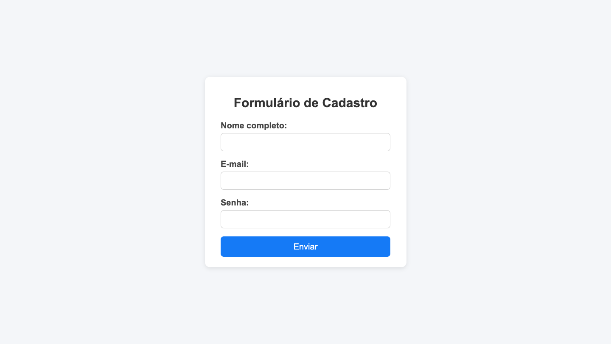
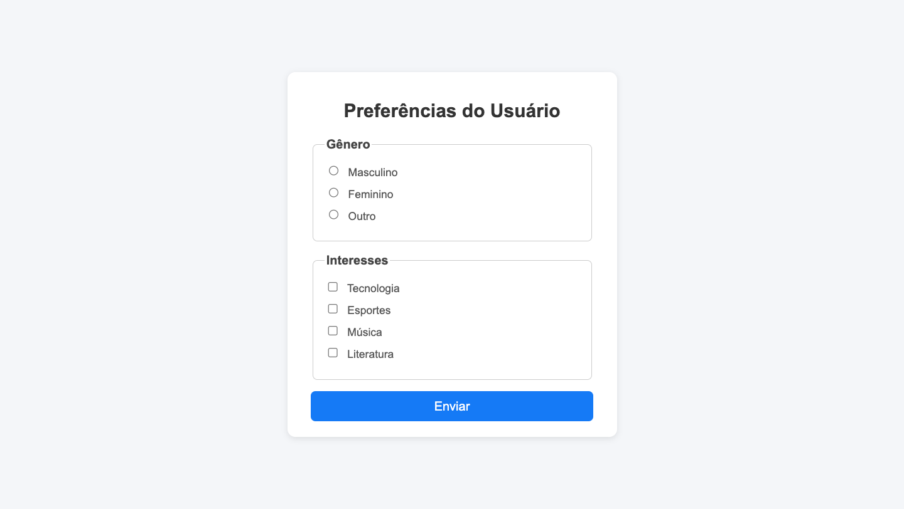
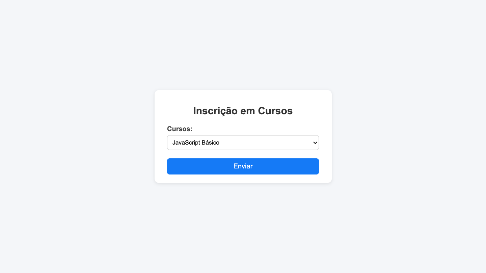
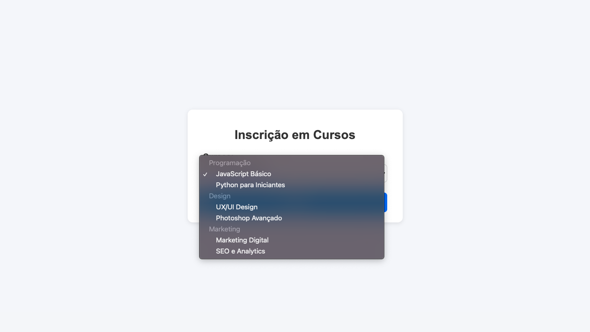
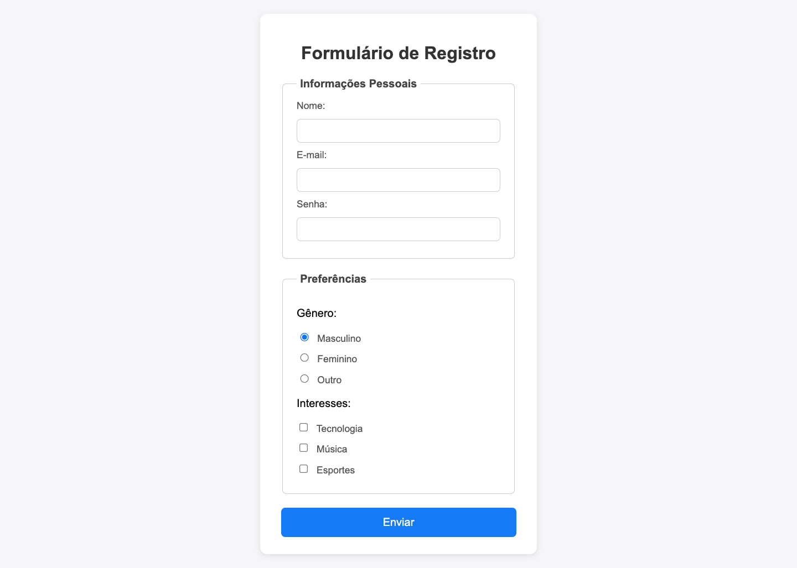
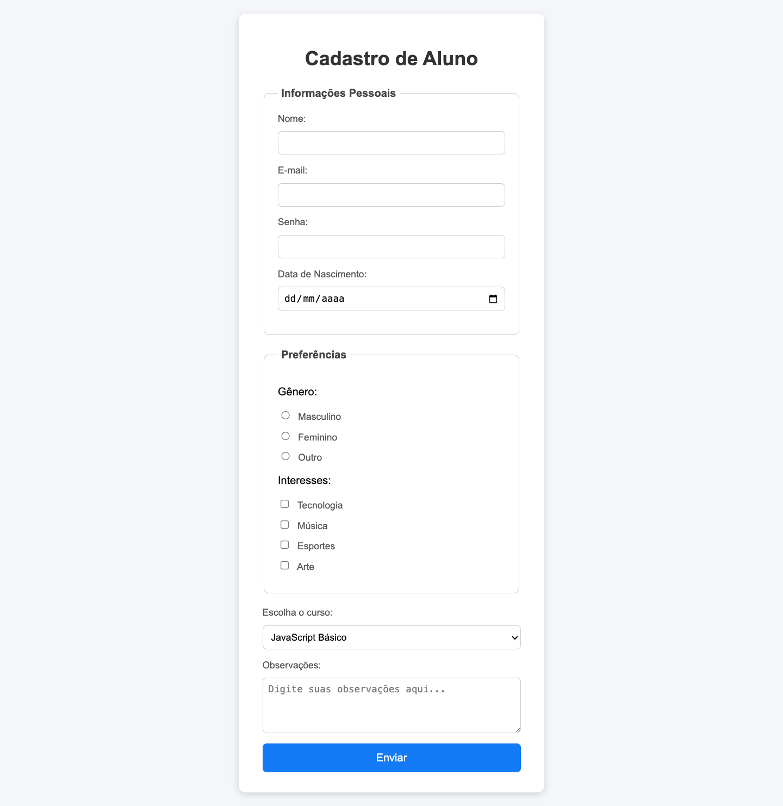
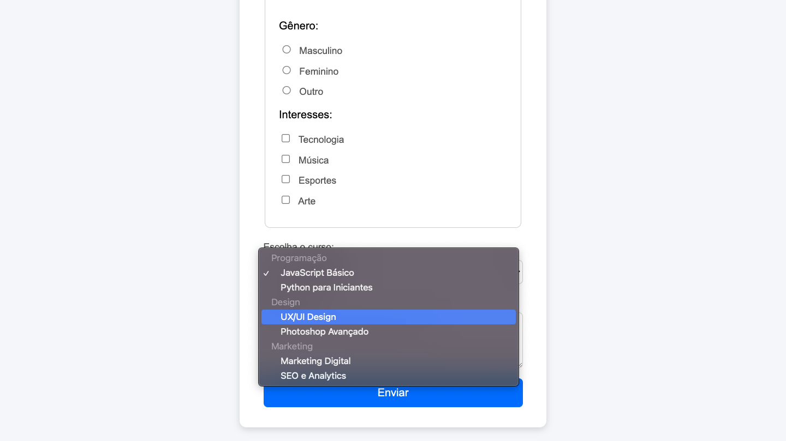

# 📝 Exercícios

---

## 🔹 Exercício 1 - Formulário de Cadastro
**Descrição:** Crie um formulário de cadastro simples para novos usuários de um site. O cliente deseja que o formulário tenha os seguintes campos:

- Nome completo
- E-mail
- Senha
- Botão de envio

Seu objetivo é construir esse formulário em HTML para que o usuário consiga preencher os dados e enviar.

**Resultado Esperado:**

---

## 🔹 Exercício 2 -Preferências do Usuário
**Descrição:** Crie um formulário que colete informações sobre as preferências dos usuários. O formulário deve conter:

- Uma pergunta de **gênero**, onde o usuário poderá escolher uma única opção (use radio).

- Uma pergunta sobre **interesses**, onde o usuário poderá escolher uma ou mais opções (use checkbox).

- Um botão de **enviar** ao final do formulário.

**Resultado Esperado:**

---

## 🔹 Exercício 3 – Seleção de Cursos

**Descrição** Crie um formulário de inscrição em cursos. O formulário deve conter:

- Um campo de seleção (`select`) com todos os cursos disponíveis.

- Os cursos devem estar organizados por **categorias** usando `optgroup`.

- Cada categoria deve ter pelo menos **duas opções** de curso.

- Um botão **Enviar** ao final do formulário.

**Resultado Esperado**

 

---

## 🔹 Exercício 4 - Formulário de Registro

**Descrição** Crie um formulário de registro de usuários em um site. O formulário deve conter:

- Um **fieldset** com a legenda (`legend`) **Informações Pessoais**, contendo:

  - Nome (`text`)
  - E-mail (`email`)
  - Senha (`password`)

- Um **fieldset** com a legenda **Preferências**, contendo:

  - Gênero (`radio`) – Masculino, Feminino, Outro
  - Interesses (`checkbox`) – Tecnologia, Música, Esportes

- Um botão **Enviar** ao final do formulário.

**Resultado Esperado:**

---

## 🔹 Exercício 5 - Cadastro de Aluno

**Descrição** Crie um formulário de cadastro completo para um site de cursos online. O formulário deve conter:

**1. Informações Pessoais** (`fieldset` + `legend`)

- Nome (`text`)
- E-mail (`email`)
- Senha (`password`)
- Data de nascimento (`date`)

**2. Preferências (`fieldset` + `legend`)**

- Gênero (`radio`)
- Interesses (`checkbox`) – Tecnologia, Música, Esportes, Arte

**3. Escolha de Cursos**
- Um `select` com cursos organizados por categoria usando optgroup

**4. Mensagem Adicional**
- Um campo `textarea` para o aluno escrever observações

**5. Botão de envio**

**Instruções opcionais caso o aluno esteja com dificuldades:**

- Use `fieldset` e `legend` para organizar os grupos de campos.
- Use `radio` para seleção única (gênero) e `checkbox` para múltipla seleção (interesses).
- Use `select` com `optgroup` para organizar os cursos.
- Use `textarea` para permitir que o usuário digite observações.
- Estilize o formulário de forma consistente: cores, bordas, espaçamento, alinhamento e hover no botão de envio.

**Resultado Esperado:**

---