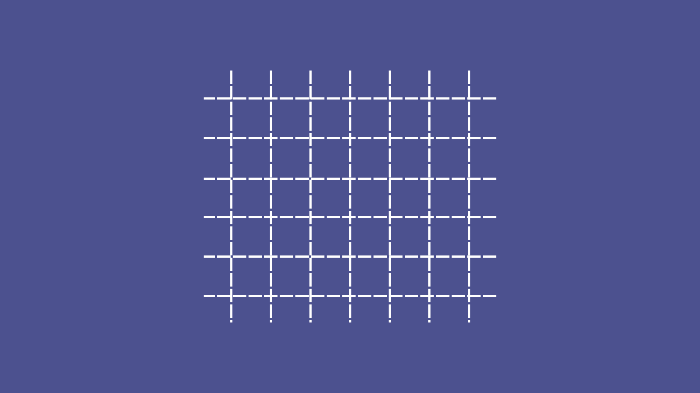
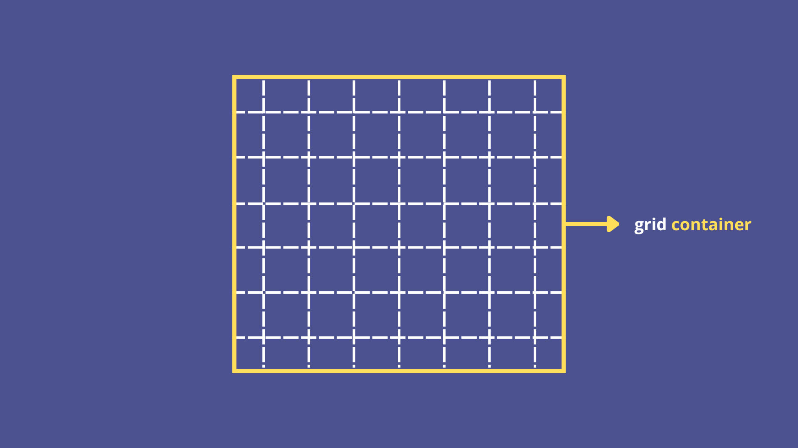
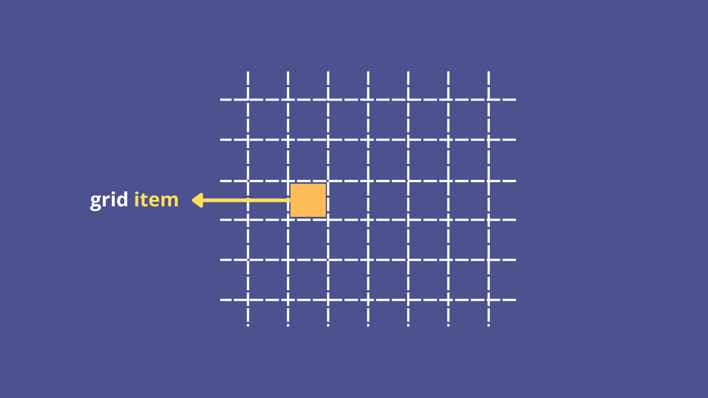
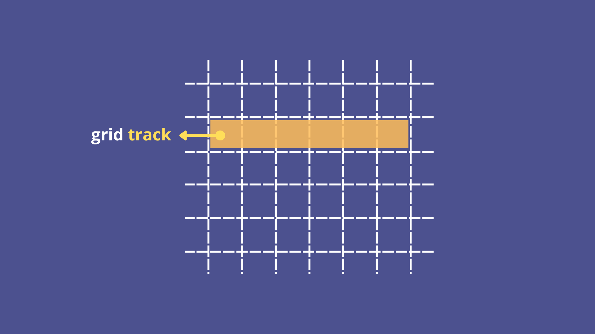
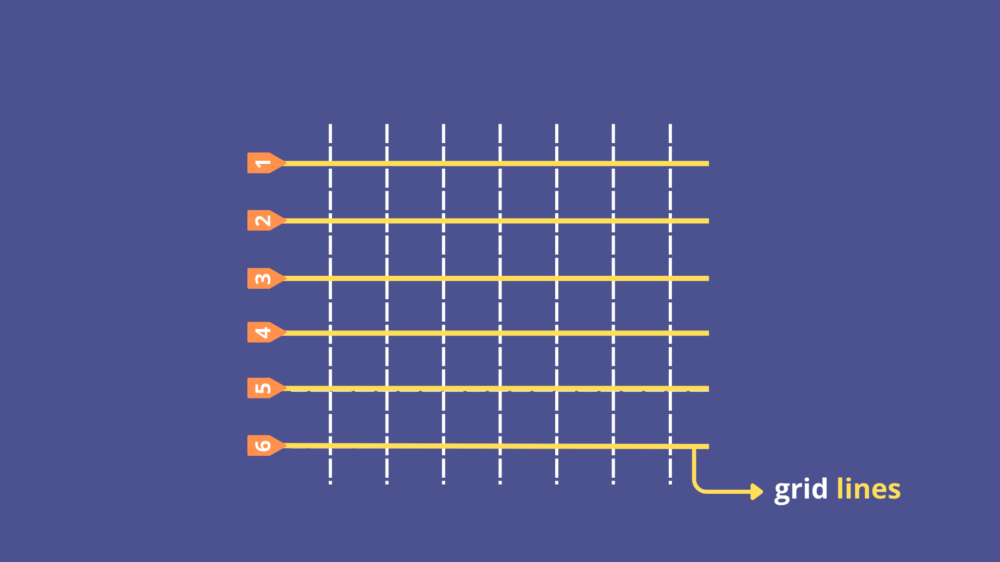
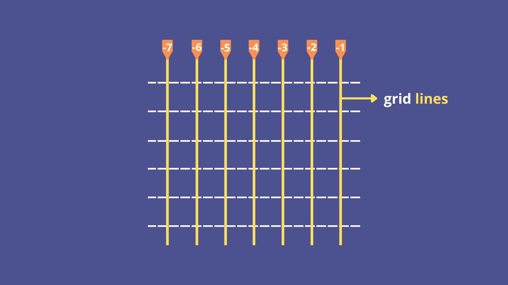
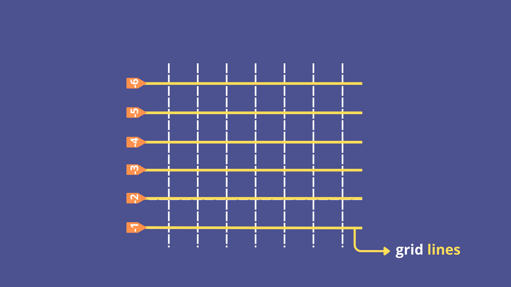
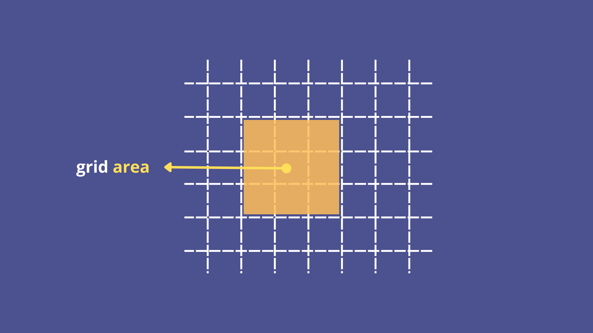
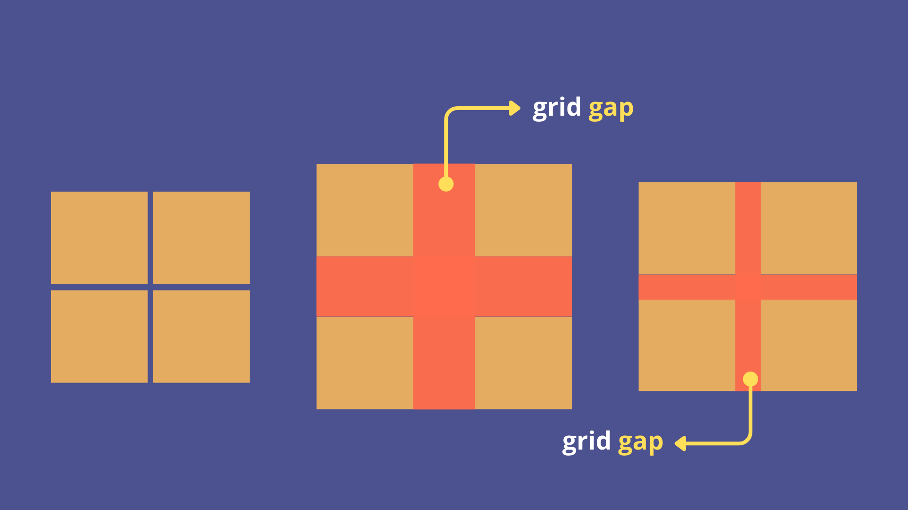

# 📘 Aula 12 - Grid

---

## 🔵 Introdução

### 🔍 O que é CSS Grid?

O **CSS Grid** é uma ferramenta poderosa para criar **layouts bidimensionais** (linhas e colunas) na web.
Ele permite organizar elementos de forma **mais clara, precisa e flexível** do que métodos antigos como floats ou posicionamento absoluto.

Com Grid, podemos criar desde **layouts simples** (como galerias) até **estruturas complexas** (como sites completos), definindo facilmente **linhas**, **colunas** e **áreas**.

<div style="height: 1px"></div>

### 🔍 Como os sites eram feitos antigamente

Antes do CSS Grid (e mesmo antes do Flexbox), os layouts de sites eram criados usando **tabelas** ou **floats**, o que causava diversos problemas:

**Tabelas:**

- Usadas para organizar conteúdo em linhas e colunas.
- Difícil de manter e adaptar em diferentes tamanhos de tela.
- Conteúdo e layout misturados, prejudicando semântica e acessibilidade.

**Floats:**

- Usados para posicionar elementos lado a lado.
- Exigia “gambiarras” como `clear: both` e `overflow: hidden`.
- Limitado para layouts bidimensionais; funcionava melhor apenas para colunas simples.

<div style="height: 1px"></div>

### 🔹 Vantagens do CSS Grid

- Layouts **2D reais** (linhas e colunas).
- **Separação de conteúdo e apresentação**.
- Controle total sobre **tamanho**, **espaçamento** e **alinhamento**.
- Fácil de criar **layouts responsivos** com poucas linhas de código.
- **Combina com Flexbox**, que continua útil para alinhar elementos dentro de uma célula ou container.

---

## 🔵 Anatomia de um Grid

Como já foi dito, o CSS Grid funciona como uma **malha bidimensional**, composta por **linhas**, **colunas** e **células**, onde os elementos podem ser posicionados de forma precisa.



Para dominar o CSS Grid, é fundamental compreender alguns conceitos básicos. A seguir, exploraremos cada um deles de forma clara e detalhada.

### 🔹 1. Grid Container

É o elemento **pai** que define o contexto da grade. Para transformar um elemento em Grid Container, usamos:

```css
.container {
  display: grid;
}
```

Todos os elementos filhos diretos do container passam a ser **grid items**.



<div style="height: 1px"></div>

### 🔹 2. Grid Item

São os **elementos filhos diretos** do grid container. Cada item pode ser posicionado nas linhas e colunas do grid.



<div style="height: 1px"></div>

### 🔹 3. Grid Track

Quando os itens se **estendem do início ao fim da grade**, formam-se os **tracks**. Esses tracks podem ser horizontais (linhas) ou verticais (colunas), servindo como guias para organizar os elementos dentro do grid.



Podemos também especificar a direção da track:

- **Row-track** → linhas horizontais.
- **Column-track** → colunas verticais.
- Cada track é separado pelas **grid lines**.


<div style="height: 1px"></div>

### 🔹 4. Grid Line

São as **linhas imaginárias** que delimitam os tracks. Elas podem ser numeradas para posicionar itens.

**Vertical:**


**Horizontal:**



Independentemente do eixo (horizontal ou vertical), essas divisões são chamadas de grid lines. Também podemos usar valores negativos para determinar as grid lines.

**Vertical:**



**Horizontal:**



<div style="height: 1px"></div>

### 🔹 5. Grid Area

É o **espaço retangular formado por linhas do grid** que um item ocupa.



<div style="height: 1px"></div>

### 🔹 6. Grid Gap (ou gap)

Define o **espaçamento entre linhas e colunas** do grid. Substitui margens “manual” e facilita a organização.



---

## 🔵 Propriedades do Grid Container

### 🔹 Criação do Grid
As propriedades a seguir definem **a estrutura básica do grid**, quantas linhas e colunas ele terá e o espaçamento entre elas.

<div style="height: 1px"></div>

#### 1. `display`

Define que o elemento será um **grid container**.
```css
.container {
  display: grid;
}
```

Todos os filhos diretos passam a ser **grid items**.

<div style="height: 1px"></div>

#### 2. `grid-template-columns`

Define **quantas colunas** o grid terá e o tamanho de cada uma.

```css
.container {
  display: grid;
  grid-template-columns: 100px 200px 300pxr;
}
```

O grid terá **3 colunas**: 100px, 200px e 300px.

<div style="height: 1px"></div>

#### 3. `grid-template-rows`

Define **quantas linhas** e o tamanho de cada linha.

```css
.container {
  grid-template-rows: 50px 100px auto;
}
```

**Três linhas**: 50px, 100px e a última se ajusta automaticamente.

<div style="height: 1px"></div>

#### 4. `gap`

Define o **espaçamento entre linhas e colunas** do grid.

```css
.container {
  gap: 10px; /* espaço uniforme */

  /* não é recomendado usar separadamente: */
  row-gap: 15px;
  column-gap: 20px;
}
```

Facilita organizar os itens sem usar margens manualmente.

<div style="height: 1px"></div>

#### 5. `grid-template`

Shorthand que permite **definir as linhas e colunas** de um grid em uma única declaração.

```css
.container {
  display: grid;
  grid-template: 50px 100px auto / 1fr 2fr 1fr;
}
```

- `50px 100px auto` → define **3 linha**s: a primeira com 50px, a segunda com 100px e a terceira com tamanho automático (auto)

- `1fr 2fr 1fr` → define **3 colunas**: a primeira e terceira ocupam 1 fração do espaço disponível, e a segunda ocupa 2 frações


<div style="height: 1px"></div>

### 🔹 Alinhamento e posicionamento do conteúdo

As propriedades a seguir são usadas para **alinhar os itens dentro do grid**, tanto individualmente quanto como um conjunto de linhas e colunas.

#### 1. `align-items`

Define o **alinhamento vertical** de cada item dentro de sua linha do grid. Valores possíveis:

- `start` → itens ficam alinhados ao início da linha (topo do container)
- `end` → itens ficam alinhados ao final da linha (base do container)
- `center` → itens ficam centralizados verticalmente
- `stretch` (padrão) → itens preenchem toda a altura da linha

<div style="height: 1px"></div>

#### 2. `justify-items`

Define o **alinhamento horizontal** de cada item dentro de sua coluna do grid. Valores possíveis:

- `start` → itens alinhados ao início da coluna (esquerda do container)
- `end` → itens alinhados ao final da coluna (direita do container)
- `center` → itens centralizados horizontalmente
- `stretch` (padrão) → itens preenchem toda a largura da coluna

<div style="height: 1px"></div>

#### 3. `align-content`

Define como **o conjunto de linhas** se comporta **verticalmente** quando há espaço sobrando. Valores possíveis:

- `start` (padrão)  → linhas alinhadas ao topo do container
- `end` → linhas alinhadas à base do container
- `center` → linhas centralizadas verticalmente
- `space-between` → espaço igual entre as linhas, sem espaço no topo ou base
- `space-around` → espaço igual nas bordas e o dobro entres as linhas.
- `space-evenly` -> espaço igual antes, entre e depois das linhas

<div style="height: 1px"></div>

#### 4. `justify-content`

Define como **o conjunto de colunas** se comporta **horizontalmente** quando há espaço sobrando. Valores possíveis:

- `start` (padrão)  → colunas alinhadas à esquerda do container
- `end` → colunas alinhadas à direita do container
- `center` → colunas centralizadas horizontalmente
- `space-between` → espaço igual entre colunas, sem espaço nas extremidades
- `space-around` → espaço igual nas bordas e o dobro entres as colunas.
- `space-evenly` -> espaço igual antes, entre e depois das colunas

<div style="height: 1px"></div>

#### 5. `place-items`

Shorthand que combina: a`lign-items` e `justify-items`. Valores possíveis: 
- Dois valores: `align-items` `justify-items`
- Um valor: aplicado para ambos eixos
- Valores possíveis individuais: `start`, `end`, `center`, `stretch`

<div style="height: 1px"></div>

#### 6. `place-content`

Shorthand que combina: `align-content` e `justify-content`. Valores possíveis:

- Dois valores: `align-content` `justify-content`
- Um valor: aplicado para ambos eixos
- Valores individuais: `start`, `end`, `center`, `space-between`, `space-around`, `stretch`

<div style="height: 1px"></div>

### 🔹 Itens automáticos e fluxo
As propriedades a seguir definem o **comportamento de itens que não foram explicitamente posicionados** e como eles preenchem linhas ou colunas automaticamente.

#### 1. `grid-auto-rows`

Define a **altura das linhas criadas automaticamente**, ou seja, linhas não declaradas em `grid-template-rows`. Valores possíveis:

- Qualquer unidade de tamanho (`px`, `%`, `em`, `fr`, `auto`)

<div style="height: 1px"></div>

#### 2. `grid-auto-columns`

Define a **largura das colunas criadas automaticamente**, ou seja, colunas não declaradas em `grid-template-columns`. Valores possíveis:

- Qualquer unidade de tamanho (`px`, `%`, `em`, `fr`, `auto`)

<div style="height: 1px"></div>

#### 3. `grid-auto-flow`

Controla **como os itens automáticos são posicionados** dentro do grid. Valores possíveis: 

- `row` → preenche linhas primeiro (padrão)
- `column` → preenche colunas primeiro
- `row dense` / `column dense` → tenta preencher buracos disponíveis, otimizando o layout

<div style="height: 1px"></div>

### 🔹Funções e unidades especiais

#### 1. `repeat()`

Função que permite **repetir tracks** (linhas ou colunas) sem precisar escrever cada valor manualmente.

```css
grid-template-columns: repeat(3, 100px);
```

Cria 3 colunas de 100px cada.

<div style="height: 1px"></div>

#### 2. `minmax()`

Função que define um **tamanho mínimo e máximo** para uma linha ou coluna.

```css
grid-template-columns: minmax(100px, 1fr);
```

A coluna terá no mínimo 100px e poderá crescer até ocupar **uma fração do espaço disponível**.

<div style="height: 1px"></div>

#### 3. Unidade `fr`

Unidade que representa **uma fração do espaço disponível** no grid.

```css
grid-template-columns: 1fr 2fr 1fr;
```

A segunda coluna ocupa **duas vezes mais espaço** que as outras duas.

---

## 🔵 Propriedades do Grid Item

### 🔹 Posicionamento dos Itens

#### 1. `grid-row-start`
Define a **linha inicial (grid-line)** em que o item será posicionado no eixo vertical. Pode ser um número de linha (1, 2, etc.) ou `span` para ocupar múltiplas.

<div style="height: 1px"></div>

#### 2. `grid-row-end`
Define a **linha final** em que o item termina no eixo vertical. Pode ser número de linha ou `span <n>` para ocupar múltiplas linhas

<div style="height: 1px"></div>

#### 3. `grid-column-start`
Define a **coluna inicial** em que o item será posicionado no eixo horizontal. Também pode usar `span <n>` para ocupar múltiplas colunas.

<div style="height: 1px"></div>

#### 4. `grid-column-end`
Define a **coluna final** em que o item termina no eixo horizontal. Também pode usar `span <n>` para ocupar múltiplas colunas.

<div style="height: 1px"></div>

**Exemplo:**
```css
.item {
  grid-row-start: 1;
  grid-row-end: 3;   /* ocupa da linha 1 até a 3 */
  grid-column-start: 2;
  grid-column-end: 4; /* ocupa da coluna 2 até a 4 */
}
```

Essas propriedades permitem posicionar **cada item explicitamente** dentro do grid, definindo o **início e o fim de sua linha e coluna**. São essenciais quando você quer controlar o layout de forma precisa.

<div style="height: 1px"></div>

### 🔹 spam e shorthand

#### 1. `span`

O valor `span` permite indicar que um item deve **ocupar várias linhas ou colunas**. Em vez de definir manualmente o número da linha final, você pode dizer quantas unidades o item deve se estender.

```css
.item {
  grid-column-start: 1;
  grid-column-end: span 2; /* ocupa 2 colunas a partir da coluna 1 */
}
```

<div style="height: 1px"></div>

#### 2. `grid-row`

É o shorthand de `grid-row-start` e `grid-row-end`. Você pode definir o ponto inicial e final de uma linha em uma única propriedade.

```css
.item {
  grid-row: 1 / 3; /* começa na linha 1 e vai até a linha 3 */
}
```

<div style="height: 1px"></div>

#### 3. `grid-column`

É o shorthand de `grid-column-start` e `grid-column-end`. Serve para definir início e fim da coluna em uma única linha.

```css
.item {
  grid-column: 2 / span 3; /* começa na coluna 2 e ocupa 3 colunas */
}
```

<div style="height: 1px"></div>

#### 4. `grid-area`
`
É o shorthand mais completo para posicionar itens. Ele combina `grid-row-start`, `grid-row-end`, `grid-column-start` e `grid-column-end` em uma única propriedade.

**Sintaxe:**
```css
grid-area: <row-start> / <column-start> / <row-end> / <column-end>;
```

```css
.item {
  grid-area: 1 / 2 / 3 / 4; 
  /* ocupa da linha 1 até a 3 e da coluna 2 até a 4 */
}
```

---